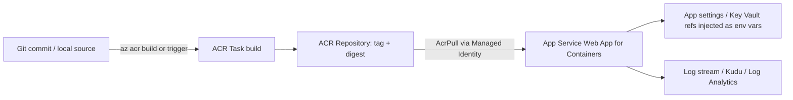

# 1. Implement Container Application Hosting on Azure

> **Domain D1 · Develop containerized solutions on Azure · 20–25% of exam**
> **Services:** Azure Container Registry, ACR Tasks, Azure App Service, Azure Key Vault, Azure Monitor · **Study time:** ~75 min · **Difficulty:** core
> **Source:** Course AI-200T00-A — Implement container application hosting on Azure

---

## 0. Syllabus Alignment

| Objective | Official skill | Covered in |
|---|---|---|
| `D1.1.a` | ACR: build, store, version, manage container images | §2.1, §2.2, §2.3, §3.1 |
| `D1.1.b` | ACR Tasks: build and run images in the cloud | §2.4, §2.5, §3.1 |
| `D1.1.c` | Deploy containers to App Service; env vars and secrets | §2.6, §2.7, §2.8, §3.2, §3.3 |

---

## 1. Architectural Summary

Azure Container Registry is the private, Azure-native equivalent of Docker Hub, purpose-built to sit between your CI pipeline and your compute target (App Service, AKS, Container Apps). It owns image storage, versioning, cloud-side builds (ACR Tasks), and vulnerability/patch propagation via triggers. It is **not** a compute or orchestration layer — it never runs your application, only builds and stores the artifact.

Azure App Service for Containers is the managed compute target: a PaaS host that pulls a single container image per app, injects configuration as environment variables, and handles scaling, TLS termination, and diagnostics. It is **not** for multi-container pod-level orchestration (that's AKS/Container Apps) — App Service (Web App for Containers) exposes exactly one HTTP port per app.

The full pipeline is: developer commits source → ACR Task builds and tags the image in the cloud → image lands in a repository with an immutable digest → App Service, authenticated via managed identity, pulls the tagged image and injects app settings/Key Vault references as env vars at container start.



**Where this fits:** ACR = image supply chain; App Service = single-container PaaS runtime; use AKS/Container Apps instead of App Service when you need multi-container pods or fine-grained orchestration.

---

## 2. Core Concepts

### 2.1 Registry hierarchy

ACR organizes content in three levels: **registry** (top-level, unique login server `<name>.azurecr.io`) → **repository** (same-named images, different tags, supports `/` namespaces like `production/inference-api`) → **artifact** (the actual image/Helm chart/OCI content, identified by tags + a SHA-256 manifest digest).

| Tier | Key features | Scenario |
|---|---|---|
| Basic | Standard storage/throughput | Dev/learning |
| Standard | More storage and throughput | Production workloads, moderate scale |
| Premium | Geo-replication, private endpoints, content trust, retention policies | Enterprise, global, compliance |

> [!WARNING] **Gotcha**
> Geo-replication, private endpoints, content trust, and registry-level retention policies are **Premium-only**. An exam question mentioning any of these is signaling "Premium tier."

### 2.2 Tags vs. digests

Tags (`repo:tag`) are **mutable** — pushing to an existing tag moves it to point at a new image. Digests (`repo@sha256:...`) are **immutable** and guarantee the exact same image everywhere.

> [!TIP] **Exam angle**
> "Guarantee every node runs the identical image, even after a new push with the same tag" → answer is **pull by digest**, not by `latest` or a semantic tag.

### 2.3 Tagging and versioning strategy

| Tag type | Example | Mutability | Use case |
|---|---|---|---|
| Stable | `v1`, `latest` | Mutable — moves on push | Base images with auto security patches, dev environments |
| Unique | `v1.2.0-build456`, `20260102-abc123` | Immutable — never reused | Production, audit trail, rollback, compliance |

Semantic versioning (`MAJOR.MINOR.PATCH`): MAJOR = breaking change, MINOR = backward-compatible feature, PATCH = bug/security fix. Combine with build ID, Git commit SHA, or timestamp for full traceability, e.g. `inference-api:v1.2.0-build4567-abc123f`.

> [!WARNING] **Gotcha**
> `latest` is the Docker default tag when none is specified on push/pull. It causes inconsistent deployments across nodes — avoid in production manifests.

Lock a production image to prevent deletion/overwrite:
```azurecli
az acr repository update --name myregistry --image inference-api:v1.2.0 --write-enabled false
```
Locked images cannot be deleted or overwritten and **survive retention/purge policies**.

Clean up orphaned (untagged) images with `acr purge`, run as a container inside an ACR Task:
```azurecli
az acr run --registry myregistry --cmd "acr purge --filter 'inference-api:.*' --untagged --ago 30d" /dev/null
```

### 2.4 ACR Tasks — quick tasks

`az acr build` sends a build context (local dir, Git repo URL, or remote tarball) to ACR, builds in the cloud, and pushes the result — no local Docker needed.

```azurecli
az acr build --registry myregistry --image inference-api:v1.0.0 .
```

> [!TIP] **Exam angle**
> Quick tasks solve "inconsistent local builds / no Docker on dev machine" scenarios — this is the canonical D1.1.b discriminator vs. geo-replication or namespaces.

### 2.5 ACR Tasks — triggers and multi-step

| Trigger type | Fires on | Config surface |
|---|---|---|
| Source code (commit/PR) | Git webhook on push/PR | `az acr task create --context <git-url>#<branch> --git-access-token` |
| Base image update | `FROM` image changes | Automatic detection if base image is in same registry (or Docker Hub); private base images should share the registry |
| Scheduled | Cron expression | `--schedule "0 0 * * *"` |

`{{.Run.ID}}` and `{{.Run.Date}}` are run-variable placeholders for unique tags per triggered build.

Multi-step tasks use a YAML pipeline (`build` → `push` → `cmd`) to build-test-push in one workflow:
```yaml
version: v1.1.0
steps:
  - build: -t {{.Run.Registry}}/inference-api:{{.Run.ID}} .
  - push:
    - {{.Run.Registry}}/inference-api:{{.Run.ID}}
  - cmd: {{.Run.Registry}}/inference-api:{{.Run.ID}} python -m pytest tests/
```

> [!WARNING] **Gotcha**
> A PyTorch/base-image security patch scenario → **base image trigger**, not source code trigger or scheduled trigger. Scheduled triggers are the fallback when automatic base-image detection isn't reliable.

### 2.6 Deploying containers to App Service

Two image sources: **Azure Container Registry** (recommended; Entra ID/managed identity, geo-replication, scanning) or **Other container registries** (any Docker Registry HTTP API V2 endpoint — Docker Hub, GHCR, self-hosted).

Authentication to ACR:

| Method | Identity lifecycle | Setup requirement |
|---|---|---|
| System-assigned managed identity | Tied to web app; created/deleted with it | Grant `AcrPull` role on registry |
| User-assigned managed identity | Independent resource, reusable across apps | Create identity, assign `AcrPull`, attach to app(s) |
| Admin credentials | Registry-level username/password | `az acr update --name myregistry --admin-enabled true` |

> [!WARNING] **Gotcha**
> Admin credentials are simpler but store secrets in App Service config and need manual rotation. Managed identity + `AcrPull` is the production-recommended path — expect the exam to reward it over admin credentials whenever "security" or "credential rotation" is mentioned.

Update the deployed image tag:
```azurecli
az webapp config container set \
    --resource-group myResourceGroup \
    --name myDocumentProcessor \
    --container-image-name myregistry.azurecr.io/docprocessor:v2
```
Pushing to the *same* tag does **not** auto-trigger a restart — App Service only pulls changed layers on restart. Enable continuous deployment for a webhook-driven pull:
```azurecli
az webapp deployment container config --resource-group myResourceGroup --name myDocumentProcessor --enable-cd true
```

### 2.7 Runtime configuration

| Setting | Purpose | Default / requirement |
|---|---|---|
| `WEBSITES_PORT` | Tells App Service which container port receives traffic | Auto-routes only ports 80/8080; any other port requires this setting |
| Startup command (`--startup-file`) | Overrides Dockerfile `CMD` | `ENTRYPOINT` unchanged |
| `WEBSITES_ENABLE_APP_SERVICE_STORAGE` | Enables persistent `/home` across restarts/instances | Disabled by default for Linux custom containers |
| Always-on (`--always-on true`) | Prevents idle shutdown (~20 min inactivity) / cold starts | Requires Basic tier or higher |
| Health check path | Periodic HTTP ping (every ~1 min); removes unhealthy instance after 10 failed pings by default | Configured via `--generic-configurations '{"healthCheckPath": "/health"}'` |

> [!WARNING] **Gotcha**
> App Service exposes **only one** HTTP port per custom container. A 404-after-deploy or connection-error scenario is almost always a `WEBSITES_PORT` mismatch, or the app binding to `localhost` instead of `0.0.0.0`.

### 2.8 App settings, connection strings, Key Vault references, slots

App settings are name-value pairs injected as environment variables, **encrypted at rest** regardless of content sensitivity. .NET nested keys (`ConnectionStrings:DefaultConnection`) become `ConnectionStrings__DefaultConnection` on Linux (colon → double underscore).

Connection strings get a type-prefixed env var name:

| Type | Env var prefix |
|---|---|
| SQL Server | `SQLCONNSTR_` |
| SQL Azure | `SQLAZURECONNSTR_` |
| MySQL | `MYSQLCONNSTR_` |
| PostgreSQL | `POSTGRESQLCONNSTR_` |
| Custom | `CUSTOMCONNSTR_` |

> [!TIP] **Exam angle**
> Non-.NET stacks (Python, Node.js) should use plain **app settings**, not connection strings — the type prefix adds no value outside .NET.

Key Vault reference syntax:
```text
@Microsoft.KeyVault(SecretUri=https://myvault.vault.azure.net/secrets/api-key)
```
Requires a managed identity on the web app with read access to the vault. Unversioned references auto-resolve to the latest secret version; App Service refreshes resolved values within **24 hours**, or immediately on any restart-triggering config change.

Slot settings stick to the **slot**, not the code, during a swap — use for environment identifiers, environment-specific endpoints, feature flags, and diagnostic verbosity:
```azurecli
az webapp config appsettings set \
    --resource-group myResourceGroup --name myDocumentProcessor --slot staging \
    --slot-settings ENVIRONMENT=staging API_ENDPOINT=https://api-staging.example.com
```

> [!WARNING] **Gotcha**
> Forgetting to mark an environment-specific setting as a **slot setting** means it swaps with the app on promotion — a classic "staging URL leaked to production" trap.

---

## 3. Production Code

### 3.1 Azure CLI

```bash
# --- ACR: create registry, build image via ACR Tasks, tag, lock ---
az acr create --resource-group rg-ai200 --name myacr --sku Standard --admin-enabled false

az acr build --registry myacr --image inference-api:v1.0.0 .

# Triggered task on git commit to main
az acr task create \
  --registry myacr \
  --name build-inference-api \
  --image inference-api:{{.Run.ID}} \
  --context https://github.com/myorg/inference-api.git#main \
  --file Dockerfile \
  --git-access-token $PAT

# Lock a production image
az acr repository update --name myacr --image inference-api:v1.0.0 --write-enabled false

# Purge untagged images older than 30 days
az acr run --registry myacr --cmd "acr purge --filter 'inference-api:.*' --untagged --ago 30d" /dev/null
```

```bash
# --- App Service: create plan, web app, wire managed identity + AcrPull, configure runtime ---
az group create --name rg-ai200 --location eastus

az appservice plan create --name plan-ai200 --resource-group rg-ai200 --sku B1 --is-linux

az webapp create \
    --resource-group rg-ai200 \
    --plan plan-ai200 \
    --name myapp \
    --container-image-name myacr.azurecr.io/inference-api:v1.0.0

az webapp identity assign --resource-group rg-ai200 --name myapp

principalId=$(az webapp identity show --resource-group rg-ai200 --name myapp --query principalId -o tsv)
acrId=$(az acr show --name myacr --resource-group rg-ai200 --query id -o tsv)

az role assignment create --assignee "$principalId" --role AcrPull --scope "$acrId"

az webapp config appsettings set \
    --resource-group rg-ai200 --name myapp \
    --settings WEBSITES_PORT=8000 WEBSITES_ENABLE_APP_SERVICE_STORAGE=true

az webapp config set --resource-group rg-ai200 --name myapp --always-on true

az webapp log config --resource-group rg-ai200 --name myapp --docker-container-logging filesystem
```

### 3.2 Python SDK

```python
import os
from azure.identity import DefaultAzureCredential
from azure.mgmt.containerregistry import ContainerRegistryManagementClient
from azure.mgmt.web import WebSiteManagementClient
from azure.mgmt.authorization import AuthorizationManagementClient
import uuid

subscription_id = os.environ["AZURE_SUBSCRIPTION_ID"]
credential = DefaultAzureCredential()

acr_client = ContainerRegistryManagementClient(credential, subscription_id)
web_client = WebSiteManagementClient(credential, subscription_id)
auth_client = AuthorizationManagementClient(credential, subscription_id)

resource_group = "rg-ai200"
registry_name = "myacr"
app_name = "myapp"

# Enable managed identity on the web app and read the resulting principal id
site = web_client.web_apps.get(resource_group, app_name)
principal_id = site.identity.principal_id if site.identity else None

# Assign AcrPull to the web app's managed identity over the registry scope
registry = acr_client.registries.get(resource_group, registry_name)
acr_pull_role_id = (
    f"/subscriptions/{subscription_id}/providers/Microsoft.Authorization/"
    "roleDefinitions/7f951dda-4ed3-4680-a7ca-43fe172d538d"  # AcrPull built-in role
)

auth_client.role_assignments.create(
    scope=registry.id,
    role_assignment_name=str(uuid.uuid4()),
    parameters={
        "role_definition_id": acr_pull_role_id,
        "principal_id": principal_id,
    },
)

# Update app settings (WEBSITES_PORT, storage)
web_client.web_apps.update_application_settings(
    resource_group,
    app_name,
    {
        "properties": {
            "WEBSITES_PORT": "8000",
            "WEBSITES_ENABLE_APP_SERVICE_STORAGE": "true",
        }
    },
)
```

### 3.3 Infrastructure (Bicep)

```bicep
param registryName string = 'myacr'
param appName string = 'myapp'
param location string = resourceGroup().location

resource acr 'Microsoft.ContainerRegistry/registries@2023-07-01' = {
  name: registryName
  location: location
  sku: { name: 'Standard' }
  properties: { adminUserEnabled: false }
}

resource plan 'Microsoft.Web/serverfarms@2023-01-01' = {
  name: 'plan-ai200'
  location: location
  kind: 'linux'
  sku: { name: 'B1' }
  properties: { reserved: true }
}

resource site 'Microsoft.Web/sites@2023-01-01' = {
  name: appName
  location: location
  identity: { type: 'SystemAssigned' }
  properties: {
    serverFarmId: plan.id
    siteConfig: {
      linuxFxVersion: 'DOCKER|${acr.properties.loginServer}/inference-api:v1.0.0'
      appSettings: [
        { name: 'WEBSITES_PORT', value: '8000' }
      ]
    }
  }
}
```

---

## 4. Memory Tricks & Mnemonics

### Mnemonics
| Device | Expands to | Locks in |
|---|---|---|
| **RRA** | Registry → Repository → Artifact | ACR three-level hierarchy order |
| **BSP** | Basic / Standard / Premium | SKU ladder; Premium = geo-rep + private endpoint + content trust |
| **TAG≠DIGEST, DIGEST=TRUTH** | Tags move, digests never do | pick digest when reproducibility matters |
| **SCP** | Source-code / base-image / scheduled | the three ACR Task trigger types |

### Analogies
- **Tag vs. digest** — a tag is a nickname you can reassign to a different person; a digest is that person's fingerprint, always unique to them.
- **ACR Tasks** — a build server you never provision: you send the recipe (Dockerfile) and ingredients (context), Azure hands back the finished dish (image) already on the shelf (registry).
- **Slot settings** — sticky notes glued to the shelf (slot), not to the box (deployment) — swapping boxes leaves the notes behind.

### Decision Matrix
| If the question says… | Answer | Because |
|---|---|---|
| "guarantee identical image on every node" | Pull by **digest** | Tags are mutable; digests are immutable SHA-256 references |
| "no local Docker install" / "inconsistent developer builds" | **ACR quick task** (`az acr build`) | Cloud-side build eliminates local variance |
| "rebuild automatically when base PyTorch image patches" | **Base image trigger** | ACR detects `FROM` image change in same/public registry |
| "traceability to source commit + rollback" | **Unique tags with Git commit SHA** | Never reused; direct link to code state |
| "prevent accidental deletion of prod image" | `az acr repository update --write-enabled false` | Locking blocks delete/overwrite, survives purge |
| "container listens on non-standard port, connection errors" | Set `WEBSITES_PORT` | App Service only auto-routes ports 80/8080 |
| "output files vanish after restart" | `WEBSITES_ENABLE_APP_SERVICE_STORAGE=true` + write to `/home` | Disabled by default; container FS is otherwise ephemeral |
| "staging URL must not swap to production" | Mark setting as **slot setting** | Slot settings stay with the slot during swap |
| "avoid stored registry credentials" | **Managed identity + `AcrPull`** | Eliminates rotation and secret storage vs. admin credentials |
| "secret needs rotation/audit trail" | **Key Vault reference** app setting | Resolves via managed identity; refreshes within 24h |
| "verify env vars actually injected" | **Kudu (SCM) Environment page** | `https://<app>.scm.azurewebsites.net/Env` shows live injected vars |
| "health check removes instance from load balancer" | Health check **path mismatch** | App checks configured path vs. actual endpoint every ~1 min, 10 failed pings default threshold |

---

## 5. Quick Q&A — Active Recall

**Q1.** What are the three levels of the ACR content hierarchy, in order?

<details>
<summary>Answer</summary>

Registry → Repository → Artifact. The registry hosts repositories (grouped by name, with optional `/` namespaces); each repository holds artifacts (images) distinguished by tags and identified by a manifest digest.

</details>

**Q2.** Which ACR tier is required for geo-replication and private endpoints?

<details>
<summary>Answer</summary>

Premium tier.

</details>

**Q3.** A base image containing CUDA drivers gets a security patch. You want dependent application images to rebuild without manual action. Which ACR Tasks feature do you configure?

<details>
<summary>Answer</summary>

A **base image update trigger** — ACR detects the `FROM` image change (in the same registry or a public registry like Docker Hub) and automatically rebuilds dependent images.

</details>

**Q4.** You deploy to App Service and requests return connection errors, even though the container starts. The container listens on port 8000. What's the fix?

<details>
<summary>Answer</summary>

Set `WEBSITES_PORT=8000` as an app setting. App Service auto-routes only ports 80/8080; any other port must be declared explicitly.

```bash
az webapp config appsettings set --resource-group myResourceGroup --name myDocumentProcessor --settings WEBSITES_PORT=8000
```

</details>

**Q5.** Managed identity vs. admin credentials for ACR authentication in App Service — which is recommended for production, and why?

<details>
<summary>Answer</summary>

Managed identity, with the `AcrPull` role assigned on the registry. It avoids storing rotating credentials in app settings and improves security auditing. Admin credentials are simpler but require manual rotation and store secrets directly in configuration.

</details>

**Q6.** You push a new image to the same tag your App Service app is already configured to use. Does App Service automatically restart and pull it?

<details>
<summary>Answer</summary>

No. App Service checks for changes and pulls updated layers only on restart; pushing to an existing tag doesn't trigger anything by itself. Either restart manually or enable continuous deployment (`az webapp deployment container config --enable-cd true`) so a registry webhook triggers the pull.

</details>

**Q7.** A staging slot needs `API_ENDPOINT=https://api-staging.example.com` to remain in staging permanently, even after a slot swap to production. How do you configure this?

<details>
<summary>Answer</summary>

Mark the app setting as a **slot setting** so it stays attached to the slot rather than swapping with the deployed code:

```bash
az webapp config appsettings set --resource-group myResourceGroup --name myDocumentProcessor --slot staging --slot-settings API_ENDPOINT=https://api-staging.example.com
```

</details>

**Q8.** Where do you go to confirm that an app setting was actually injected as an environment variable inside the running container, without SSH access?

<details>
<summary>Answer</summary>

The Kudu (SCM) diagnostic console's Environment page, at `https://<app-name>.scm.azurewebsites.net/Env`.

</details>

---

## 6. Hands-On Challenge

### 6.1 Problem

**Scenario.** You maintain a document-processing inference API. Builds currently happen on developer laptops, producing inconsistent images and no audit trail. You need a cloud-built, uniquely tagged image stored in ACR, deployed to App Service using managed identity (no stored credentials), listening on a non-default port, with persisted output files and container logs available for troubleshooting.

**Build it.**
1. Create an ACR (Standard tier) and build the image in the cloud with a unique tag using `az acr build`.
2. Create a Linux App Service plan and Web App for Containers referencing that image.
3. Enable system-assigned managed identity on the web app and grant it `AcrPull` on the registry.
4. Configure `WEBSITES_PORT` for the app's actual listening port (8000) and enable persistent storage for `/home/output/`.
5. Enable container filesystem logging and verify with the log stream.

**Done when:** the app's default hostname responds successfully over HTTPS, `WEBSITES_PORT` matches the container's listening port, the managed identity has an `AcrPull` role assignment (no admin credentials used), and `az webapp log tail` shows live container output.

**Est. time:** 30 min · **Teardown:** `az group delete -n rg-ai200 --yes --no-wait`

### 6.2 Reference Solution

```bash
# Step 1 — Resource group and registry (Standard SKU: production-grade storage/throughput, no admin user)
az group create --name rg-ai200 --location eastus
az acr create --resource-group rg-ai200 --name myacr --sku Standard --admin-enabled false

# Step 2 — Cloud build with a unique, traceable tag (never reused; supports rollback/audit)
az acr build --registry myacr --image docprocessor:v1.0.0-build001 .

# Step 3 — Linux App Service plan (Basic tier minimum for always-on, used later if needed) and web app
az appservice plan create --name plan-ai200 --resource-group rg-ai200 --sku B1 --is-linux
az webapp create \
    --resource-group rg-ai200 \
    --plan plan-ai200 \
    --name mydocprocessor \
    --container-image-name myacr.azurecr.io/docprocessor:v1.0.0-build001

# Step 4 — System-assigned managed identity + AcrPull (avoids storing registry credentials)
az webapp identity assign --resource-group rg-ai200 --name mydocprocessor

principalId=$(az webapp identity show --resource-group rg-ai200 --name mydocprocessor --query principalId -o tsv)
acrId=$(az acr show --name myacr --resource-group rg-ai200 --query id -o tsv)

az role assignment create --assignee "$principalId" --role AcrPull --scope "$acrId"

# Step 5 — Runtime settings: port + persistent storage
az webapp config appsettings set \
    --resource-group rg-ai200 --name mydocprocessor \
    --settings WEBSITES_PORT=8000 WEBSITES_ENABLE_APP_SERVICE_STORAGE=true

# Step 6 — Container logging and live verification
az webapp log config --resource-group rg-ai200 --name mydocprocessor --docker-container-logging filesystem
az webapp log tail --resource-group rg-ai200 --name mydocprocessor
```

```python
# Step 7 — Verify hostname resolves and app responds
import requests

hostname = "mydocprocessor.azurewebsites.net"
resp = requests.get(f"https://{hostname}/health", timeout=10)
assert resp.status_code == 200, f"Unexpected status: {resp.status_code}"
print("Health check passed:", resp.json())
```

### 6.3 Commentary

Step 1 selects **Standard** over Basic because production workloads need higher storage/throughput ceilings (§2.1) — maps to `D1.1.a`. Step 2 rejects a stable tag like `latest` in favor of a unique build-numbered tag, satisfying the traceability/rollback requirement from §2.3 (`D1.1.a`/`D1.1.b`) — the alternative (mutable tag) would break reproducibility across restarts. Step 3 rejects Docker Hub/"other registry" credentials because the exercise mandates zero stored secrets — this forces the ACR + managed identity path (`D1.1.c`). Step 4 is the security-critical step: `AcrPull` role assignment replaces admin-credential username/password, directly addressing the exam's preferred authentication pattern (§2.6). Step 5 sets `WEBSITES_PORT` because the container listens on 8000, not the auto-routed 80/8080 (§2.7); `WEBSITES_ENABLE_APP_SERVICE_STORAGE` is required because Linux custom containers default to ephemeral storage. Step 6 wires up diagnostics (§2.8/troubleshooting) so a future failed deployment is debuggable via log stream instead of guesswork.

---

## 7. Exam-Day Cheatsheet

**Key facts**
- `WEBSITES_PORT` — required whenever the container listens on anything other than 80/8080; App Service exposes exactly one HTTP port per custom container.
- `WEBSITES_ENABLE_APP_SERVICE_STORAGE=true` — required to persist `/home` on Linux custom containers; disabled by default.
- `AcrPull` — the role to assign to a web app's managed identity for registry pull access; preferred over admin credentials.
- Digests are immutable; tags are mutable — pull by digest for guaranteed reproducibility.
- Base image triggers auto-rebuild dependent images; require same-registry (or public) base image for detection.
- Premium ACR tier — required for geo-replication, private endpoints, content trust, and registry-level retention policies.
- Always-on requires **Basic tier or higher**; keeps the app warm past the ~20-minute idle threshold.
- Key Vault references refresh within 24 hours automatically, or immediately on any config change that restarts the app.
- Slot settings stay with the slot (not the code) during a swap.

**Commands worth knowing cold**
```bash
az acr build --registry myacr --image inference-api:v1.0.0 .
az acr task create --registry myacr --name t1 --image app:{{.Run.ID}} --context <git-url>#main --file Dockerfile --git-access-token $PAT
az acr repository update --name myacr --image app:v1 --write-enabled false
az webapp config appsettings set --resource-group rg --name app --settings WEBSITES_PORT=8000
az webapp identity assign --resource-group rg --name app
az webapp log tail --resource-group rg --name app
```

**Top gotchas**
1. Pushing a new image to the *same* tag does not auto-restart App Service — enable continuous deployment or restart manually.
2. `latest` tag → inconsistent deployments across nodes; never use in production manifests.
3. Health check path mismatch (configured path ≠ actual app endpoint) silently drops healthy instances from the load balancer.
4. Forgetting `--slot-settings` lets an environment-specific value swap into production.
5. Admin credentials "work" but fail the security-conscious exam answer whenever managed identity is available.

---

## 9. Sources

- [Introduction](https://learn.microsoft.com/en-us/training/modules/store-manage-containers-azure-container-registry/1-introduction)
- [Registries, repositories, and artifacts](https://learn.microsoft.com/en-us/training/modules/store-manage-containers-azure-container-registry/2-image-storage)
- [Build and run images with ACR Tasks](https://learn.microsoft.com/en-us/training/modules/store-manage-containers-azure-container-registry/3-build-run-acr-tasks)
- [Tag and version images](https://learn.microsoft.com/en-us/training/modules/store-manage-containers-azure-container-registry/4-tag-version-images)
- [Exercise - Build and manage a container image with ACR Tasks](https://learn.microsoft.com/en-us/training/modules/store-manage-containers-azure-container-registry/5-exercise-build-manage-acr-tasks)
- [Module assessment](https://learn.microsoft.com/en-us/training/modules/store-manage-containers-azure-container-registry/6-module-assessment)
- [Summary](https://learn.microsoft.com/en-us/training/modules/store-manage-containers-azure-container-registry/7-summary)
- [Introduction](https://learn.microsoft.com/en-us/training/modules/deploy-containers-azure-app-service/1-introduction)
- [Deploy containers to Azure App Service](https://learn.microsoft.com/en-us/training/modules/deploy-containers-azure-app-service/2-deploy-containers)
- [Configure container runtime behavior](https://learn.microsoft.com/en-us/training/modules/deploy-containers-azure-app-service/3-configure-runtime)
- [Configure application settings](https://learn.microsoft.com/en-us/training/modules/deploy-containers-azure-app-service/4-configure-settings)
- [Observe and troubleshoot containerized apps](https://learn.microsoft.com/en-us/training/modules/deploy-containers-azure-app-service/5-observe-troubleshoot)
- [Exercise - Deploy a container to Azure App Service](https://learn.microsoft.com/en-us/training/modules/deploy-containers-azure-app-service/6-exercise)
- [Module assessment](https://learn.microsoft.com/en-us/training/modules/deploy-containers-azure-app-service/7-module-assessment)
- [Summary](https://learn.microsoft.com/en-us/training/modules/deploy-containers-azure-app-service/8-summary)
