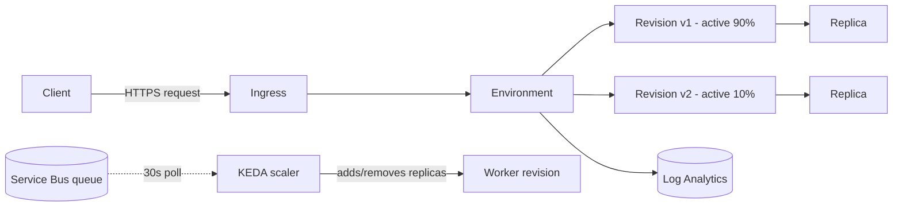

# 2. Deploy, Manage, and Scale Container Apps

> **Domain D1 · Develop containerized solutions on Azure · 20–25% of exam**
> **Services:** Azure Container Apps, Azure Container Registry, KEDA, Azure Service Bus, Azure Storage Queue, Azure Event Hubs · **Study time:** ~35 min · **Difficulty:** core
> **Source:** Course AI-200T00-A — Deploy and manage apps on Azure Container Apps

---

## 0. Syllabus Alignment

| Objective | Official skill | Covered in |
|---|---|---|
| `D1.2.a` | Container Apps: deploy, environment config, revision management, ingress, traffic split | §2.1, §2.2, §2.5, §3.1 |
| `D1.2.b` | Event-driven scaling with KEDA in Container Apps | §2.7, §2.8, §3.1, §3.2 |
| `D1.2.c` | AKS: deploy and manage apps via manifest files | §2.10, §8 |
| `D1.2.d` | Monitor/troubleshoot AKS and Container Apps: logs, events, connectivity | §2.6, §2.10, §8 |

---

## 1. Architectural Summary

Azure Container Apps (ACA) is a managed, serverless container runtime built on top of Kubernetes primitives (KEDA, Envoy-based ingress) without exposing a control plane to you. AI backends need this: a document-processing API that must absorb bursty synchronous traffic and a background OCR/embedding worker that must drain a queue and scale to zero between jobs. ACA gives you revisions, ingress, and declarative scale rules as first-class objects instead of hand-rolled orchestration.

The **environment** is the operative isolation unit — it scopes networking (internal DNS between apps), Log Analytics integration, and ingress mode. Apps inside the same environment can call each other privately; apps in different environments cannot, without additional networking. Secrets and registry credentials are decoupled from the container image, so the same image runs unmodified across dev, test, and production — only the environment variables and secret references change.

ACA is **not** a substitute for AKS when you need direct `kubectl`/manifest control, custom CNI, DaemonSets, or node-level tuning — that territory belongs to the AKS objective (`D1.2.c`) in this same domain, which the source material for this note does not cover (see §2.10, §8).

Revisions and KEDA are the throughline of the whole path: any change to the `template` section (image, env vars, scale rules) creates a new immutable revision, and KEDA translates your declarative scale rule — whether a built-in HTTP/TCP trigger or any ScaledObject-compatible custom trigger — into a replica count on a 15- or 30-second polling cadence.



**Where this fits:** simpler and more serverless than AKS (no nodes, no manifests, built-in KEDA/ingress); more deployment-and-scaling structure than raw App Service (revisions, traffic splitting, event-driven scale-to-zero).

---

## 2. Core Concepts

### 2.1 Environments, ingress, and observability

A Container Apps **environment** is the shared boundary for networking, logging, and isolation across the apps deployed into it. You either create one explicitly with `az containerapp env create` or let `az containerapp up` create one implicitly — explicit creation gives you naming/lifecycle control when multiple apps must share it. The Container Apps CLI surface requires the extension: `az extension add --name containerapp --upgrade` (add `--allow-preview true` for preview features). Before first deployment, register `Microsoft.App` and `Microsoft.OperationalInsights` as resource providers.

| Ingress mode | Reachable from | Use case |
|---|---|---|
| `external` | Public internet and other apps in the environment | Public-facing AI API a web client calls directly |
| `internal` | Only other apps inside the same environment | Backend service only called by another app in-environment |

> [!TIP] **Exam angle**
> The environment — not the revision, not the replica — is the resource that scopes shared networking and Log Analytics integration. Expect a question that asks "which resource provides that shared boundary."

> [!WARNING] **Gotcha**
> If you skip provider registration (`Microsoft.App`, `Microsoft.OperationalInsights`) the first deployment in a new subscription fails with an unhelpful error that looks unrelated to registration.

### 2.2 Deployment workflows: CLI vs YAML

`az containerapp up` is the fastest path — it can auto-create the environment and returns the ingress FQDN via `--query properties.configuration.ingress.fqdn`. `az containerapp create` is the explicit path when you need to align to a pre-existing environment and resource group. Both accept `--yaml`, and **when you use `--yaml`, every other CLI flag is ignored** — the file becomes the sole source of truth, which is why teams store it in source control for reviewable, repeatable deploys.

| Method | Control | Best for |
|---|---|---|
| `az containerapp up` | Least — can auto-create environment | First deployment, prototyping |
| `az containerapp create` | Explicit env/resource-group alignment | Structured deployment across environments |
| `--yaml` on create/update | Full — file is sole source of truth | CI/CD, many settings, config reviewed like code |

> [!WARNING] **Gotcha**
> Public image references must use a **lower-case** repository path (e.g., `mcr.microsoft.com/k8se/quickstart`). Upper-case path segments produce pull failures that present like authentication errors, not casing errors.

### 2.3 Runtime configuration: environment variables and secrets

Non-sensitive settings (log level, feature flags, dependency URLs) go in environment variables — `--env-vars` at create time, `--set-env-vars` at update time (adds/updates without dropping existing vars). Sensitive values go into Container Apps **secrets** via `az containerapp secret set --secrets key=value`, then get mapped into an env var without exposing the value using the `secretref:<secret-name>` pattern on the CLI or `secretRef:` in YAML.

```yaml
# focus fragment: env var + secret reference
properties:
  template:
    containers:
    - name: ai-api
      env:
      - name: LOG_LEVEL
        value: info
      - name: EMBEDDINGS_API_KEY
        secretRef: embeddings-api-key
```

> [!TIP] **Exam angle**
> "Don't store the value in a YAML file" is the exact discriminator for choosing secrets + `secretref:` over a plain `env:` entry.

### 2.4 Private registry authentication

Registry credentials configure separately from application configuration via `az containerapp registry set`. Username/password is simplest and works with non-ACR registries but increases secret-rotation overhead. Managed identity is the production pattern for Azure Container Registry — grant the identity the **`AcrPull`** role on the registry, then configure with `--identity system` (or a user-assigned identity resource ID) instead of `--username`/`--password`.

| Method | Configure with | Best for |
|---|---|---|
| Username/password | `--server --username --password` | Quick validation; non-ACR registries |
| Managed identity | `--server --identity system` + `AcrPull` role | Production ACR; avoids long-lived credential rotation |

> [!WARNING] **Gotcha**
> Image pull failures after a registry change surface in container logs as errors that *look like* authentication/permission problems — always check registry config (`az containerapp registry show`) before assuming an application-layer bug.

### 2.5 Revisions, revision modes, and traffic splitting

A revision is an **immutable** snapshot of the app's configuration. Changes fall into two categories: **revision-scope** changes (image, scale rules, env vars — anything in `template`) create a new revision; **application-scope** changes (secrets, ingress, traffic-split weights) do not.

| Mode | Active revisions | Traffic control | Behavior |
|---|---|---|---|
| Single (default) | 1 | All traffic to current revision | Zero-downtime cutover: new revision provisions, passes health checks, matches old replica count, then traffic shifts and old revision deactivates automatically |
| Multiple (`--revision-mode multiple`) | Many | `az containerapp ingress traffic set --revision-weight` | Old revisions stay active until you explicitly deactivate them — required for canary/blue-green/A-B |

Inactive revisions consume no resources but remain available for rollback; Container Apps automatically purges the oldest once you exceed **100 inactive revisions** (tune with `--max-inactive-revisions`). Traffic weights can target a specific revision name or the literal `latest`, which auto-targets whichever revision is newest without a rule update. **Revision labels** give a fixed URL that always routes to one specific revision regardless of the traffic split — useful for tester validation before adding a revision to the split. Label names must start with a letter, use only lowercase alphanumerics and dashes, no consecutive dashes, and stay ≤64 characters.

> [!TIP] **Exam angle**
> "10% of traffic to the new version for validation" always implies **multiple revision mode + `--revision-weight`**. Single revision mode cannot split traffic at all.

> [!WARNING] **Gotcha**
> Two revisions each with `minReplicas: 1` on a 50/50 split maintain at least **two** replicas total and each scales only off its own half of traffic — total resource consumption during a long-lived split can exceed what one revision at 100% traffic would need. Move through canary percentages quickly and deactivate the old revision promptly.

### 2.6 Lifecycle actions and health probes

`az containerapp stop` / `start` act on the whole app (all revisions) — too broad if only one revision misbehaves. `az containerapp revision deactivate` is the safer, narrower first step: it preserves evidence for investigation and keeps rollback available, unlike deletion. `az containerapp restart` forces replicas to restart to clear a stuck/deadlocked state, but for AI services that load large models at startup, restarting too aggressively increases cold-start frequency — pair it with log inspection, don't use it blind.

Readiness and liveness probes protect rollouts:

| Probe | Question | On failure | Tuning knob |
|---|---|---|---|
| Readiness | Can this replica take traffic right now? | Removed from traffic (not restarted) | `initialDelaySeconds` — give model-loading time before checks start |
| Liveness | Is this process still healthy? | Replica is restarted | `failureThreshold`/`timeoutSeconds` — too aggressive causes restart storms |

```yaml
# focus fragment: readiness/liveness probes
properties:
  template:
    containers:
    - name: api
      probes:
      - type: Readiness
        httpGet: { path: /health/ready, port: 8080 }
        initialDelaySeconds: 20
        periodSeconds: 10
        timeoutSeconds: 2
        failureThreshold: 3
      - type: Liveness
        httpGet: { path: /health/live, port: 8080 }
        initialDelaySeconds: 60
        periodSeconds: 10
        timeoutSeconds: 2
        failureThreshold: 3
```

Log streaming with `az containerapp logs show --follow` (add `--tail 30` and `--type system` for platform-level logs) is the fastest first diagnostic step for a revision that fails to start. Common probe-failure root causes to validate first: wrong port, wrong path, timeout too short for model warmup, or a dependency call at startup that fails/is slow.

> [!WARNING] **Gotcha**
> Deploying with the wrong port is a *configuration* trap, not a code bug — validate port/path before assuming a code regression.

### 2.7 Scale rules: HTTP, TCP, CPU, memory

A scale definition has three parts: **limits** (min/max replicas), **rules** (triggers), **behavior** (timing). With ingress enabled and no custom rule, the default scales up to **10 replicas**, min **0**. If ingress is disabled and you set neither a minimum replica count nor a custom scale rule, the app scales to zero and **can't restart** — there's no trigger to bring it back.

HTTP scaling computes concurrent requests as *(requests received in the past 15 seconds) / 15*; default threshold is **10 requests per replica**. TCP scaling uses the same 15-second window but counts active connections — better for WebSocket/gRPC/pooled-connection workloads. Both support scale-to-zero.

CPU and memory rules **cannot scale to zero** — they require at least one running replica to measure utilization, so a minimum of one replica is always maintained regardless of your configured minimum.

| Scale rule type | Metric | Scale-to-zero? | Scenario |
|---|---|---|---|
| HTTP | Concurrent requests / 15s window (default 10/replica) | Yes | Synchronous API / web app |
| TCP | Concurrent connections / 15s window | Yes | WebSocket, gRPC, DB connection pools |
| CPU | % utilization | No — min 1 always | Compute-heavy inference, transcoding |
| Memory | % utilization | No — min 1 always | Caching, large dataset aggregation |
| KEDA custom (event-driven) | Queue depth, lag, etc. / 30s poll | Yes | Async background workers |

**Scaling behavior timing:** custom scalers (CPU, memory, event-driven) poll every **30 seconds**. The **cool-down period** before scale-down-to-zero is **300 seconds** (5 minutes) by default — this is also the **scale-down stabilization window**. The **scale-up stabilization window is 0 seconds** (scale-up starts immediately), and scale-up proceeds in steps of **1, 4, 8, 16, 32...** (doubling *after* the initial 1 -> 4 jump) up to the max. On scale-down, all excess replicas are removed at once, not gradually.

> [!WARNING] **Gotcha**
> "Set `min-replicas 0` with a CPU scale rule" never achieves scale-to-zero — CPU/memory scalers floor at one replica. Use HTTP, TCP, or a KEDA event-driven rule when scale-to-zero is a stated requirement.

### 2.8 Event-driven scaling with KEDA

ACA is powered by **KEDA (Kubernetes Event-driven Autoscaling)**; custom scalers follow the KEDA ScaledObject pattern (type + metadata + auth), and the platform polls the event source every 30 seconds. Microsoft-maintained, Azure-native scalers: Service Bus, Event Hubs, Storage Queue, Blob Storage, Log Analytics, Azure Monitor. Community-maintained scalers cover non-Azure sources like Kafka, Redis (Lists/Streams), Cron, Prometheus, PostgreSQL, MySQL, MongoDB.

| Scaler | `--scale-rule-type` | Key metadata | Threshold param | Example math |
|---|---|---|---|---|
| Azure Service Bus | `azure-servicebus` | `queueName`/`topicName`+`subscriptionName`, `namespace` | `messageCount` | 50 messages ÷ `messageCount=5` → 10 replicas |
| Azure Storage Queue | `azure-queue` | `accountName`, `queueName` | `queueLength` | Same pattern, lower cost/lower throughput than Service Bus |
| Azure Event Hubs | `azure-eventhub` | `consumerGroup`, `checkpointStrategy` (recommended: `blobMetadata`) | `unprocessedEventThreshold` | Capped by partition count — one consumer per partition per group |
| Apache Kafka | `kafka` | `bootstrapServers`, `consumerGroup`, `topic` | `lagThreshold` | 500 lag ÷ `lagThreshold=100` → 5 replicas |
| Redis (Lists/Streams) | `redis` (Lists), `redis-cluster`, `redis-streams` †  | `address`, `listName`, `listLength` (Lists) or pending-entries per consumer group (Streams) | `listLength` | Streams accounts for in-flight, unacknowledged work |
| Cron | `cron` | `timezone`, `start`, `end`, `desiredReplicas` | `desiredReplicas` | Fixed baseline during a scheduled window |
| Prometheus | `prometheus` † | `serverAddress`, `query`, `threshold` (required); `metricName` optional | `threshold` | PromQL result ÷ threshold |

Authentication is secrets-based — `--scale-rule-auth "<triggerParameter>=<secretName>"`, where the left side is the scaler's auth parameter (e.g. `connection`) and the right side is the name of a Container Apps secret — or managed-identity-based via `--scale-rule-identity system` (or a user-assigned identity resource ID), e.g. granting `Azure Service Bus Data Receiver` on the namespace. Prefer managed identity in production. When **multiple scalers** are active on one app (e.g., cron + HTTP), Container Apps uses the **highest** replica count among them.

† Type strings for the two community scalers above are **not stated in the Learn source** — they are confirmed against the upstream KEDA scaler documentation (`keda.sh/docs/*/scalers/`), which is what Container Apps passes them through to. Treat them as reliable for building, but see §8.

> [!TIP] **Exam angle**
> "5 replicas ready before an 8 AM spike, scale to zero overnight" = **cron scaler + HTTP scaler combined**. Cron sets the floor during the window; HTTP handles bursts; highest wins.

> [!WARNING] **Gotcha**
> Setting `maxReplicas` above your Event Hub/Kafka partition count buys nothing — each partition supports only one active consumer per consumer group.

### 2.9 Compute resources and workload profiles

CPU is specified in cores (fractions allowed), memory in GiB, per container. **Memory must be at least twice the CPU value in GiB** (e.g., 0.5 CPU requires ≥1.0 GiB memory). Default allocation is **0.25 cores / 0.5 GiB**. In the **Consumption** plan, the maximum per container is **4 cores / 8 GiB**. Exceeding the **memory** limit kills and restarts the replica (hard failure); exceeding the **CPU** limit throttles it (performance degradation, no restart).

| Environment type | Billing | Max per container | Use when |
|---|---|---|---|
| Consumption-only | Pay per vCPU-second/GiB-second; idle replicas at lower rate; scale-to-zero = $0 | 4 cores / 8 GiB | Variable traffic, most APIs and workers |
| Workload profiles — Consumption profile | Same serverless billing | 4 cores / 8 GiB | Coexists with Dedicated in one environment |
| Workload profiles — Dedicated profile | Reserved VM size | Larger; required for GPU | Consistent low-variance latency, GPU inference, compliance mandates |

Maximum replica count is **1000 per revision**. Total capacity = per-replica resources × replica count — size both together against measured peak load.

> [!WARNING] **Gotcha**
> GPU workloads and any allocation above 4 cores/8 GiB per container require a **Dedicated** workload profile — Consumption cannot serve them regardless of `--cpu`/`--memory` values requested.

### 2.10 AKS manifest deployment — coverage gap

`D1.2.c` (deploy/manage AKS apps via manifest files: `kubectl`, `Deployment`, `Service`, `Pod`, `namespace`) and the AKS half of `D1.2.d` (`kubectl logs`, `kubectl describe`, events) are **not covered by any unit in this source set** — every unit across all three modules is Azure Container Apps-specific. Do not assume ACA revision/probe/scaling mechanics map 1:1 onto raw Kubernetes manifests; AKS requires explicit `Deployment`/`Service` YAML and direct `kubectl` operation that this note cannot source. See §8.

> [!WARNING] **Gotcha**
> Don't conflate ACA's automatic revision-based zero-downtime rollout (single revision mode) with a Kubernetes `Deployment`'s rolling-update strategy — they're platform-specific mechanisms with different knobs, and the exam scopes them as separate objectives (`D1.2.a` vs `D1.2.c`).

---

## 3. Production Code

### 3.1 Azure CLI

```bash
# 1. Setup — extension, providers, resource group, explicit environment
az login
az upgrade
az extension add --name containerapp --upgrade

az provider register --namespace Microsoft.App
az provider register --namespace Microsoft.OperationalInsights

az group create --name rg-ai200 --location centralus

az containerapp env create \
  --name aca-env-ai200 \
  --resource-group rg-ai200 \
  --location centralus

# 2. Create the sync API app: managed-identity registry pull + HTTP scale rule
az containerapp create \
  --name doc-api \
  --resource-group rg-ai200 \
  --environment aca-env-ai200 \
  --image myacr.azurecr.io/doc-api:v1 \
  --revision-suffix v1 \
  --ingress external \
  --target-port 8000 \
  --env-vars LOG_LEVEL=info FEATURE_EMBEDDINGS=true \
  --min-replicas 1 --max-replicas 10 \
  --scale-rule-name http-scaling \
  --scale-rule-type http \
  --scale-rule-http-concurrency 50

az containerapp registry set -n doc-api -g rg-ai200 \
  --server myacr.azurecr.io \
  --identity system

# 3. Secret + secretref for the embeddings provider key
az containerapp secret set -n doc-api -g rg-ai200 \
  --secrets embeddings-api-key="REPLACE_WITH_REAL_VALUE"

az containerapp update -n doc-api -g rg-ai200 \
  --set-env-vars EMBEDDINGS_API_KEY=secretref:embeddings-api-key

# 4. Canary rollout: enable multiple revision mode, ship v2 by digest, split traffic
az containerapp update -n doc-api -g rg-ai200 \
  --revision-mode multiple

az containerapp update -n doc-api -g rg-ai200 \
  --revision-suffix v2 \
  --image myacr.azurecr.io/doc-api@sha256:55256f162d29d311696e5132c4599e3464a6f97af93164e180e51de252afd93b

az containerapp ingress traffic set -n doc-api -g rg-ai200 \
  --revision-weight doc-api--v1=90 doc-api--v2=10

# 5. Verify: logs, revisions, replicas
az containerapp logs show -n doc-api -g rg-ai200 --follow --tail 30
az containerapp revision list -n doc-api -g rg-ai200 -o table
az containerapp replica list -n doc-api -g rg-ai200
```

### 3.2 Infrastructure (YAML)

```yaml
# containerapp.yaml — full template combining runtime config, probes, and scale rules
properties:
  configuration:
    ingress:
      external: true
      targetPort: 8000
    secrets:
      - name: embeddings-api-key
        value: REPLACE_WITH_REAL_VALUE
  template:
    containers:
      - name: doc-api
        image: myacr.azurecr.io/doc-api@sha256:55256f162d29d311696e5132c4599e3464a6f97af93164e180e51de252afd93b
        env:
          - name: LOG_LEVEL
            value: info
          - name: EMBEDDINGS_API_KEY
            secretRef: embeddings-api-key
        probes:
          - type: Readiness
            httpGet:
              path: /health/ready
              port: 8080
            initialDelaySeconds: 20
            periodSeconds: 10
            timeoutSeconds: 2
            failureThreshold: 3
          - type: Liveness
            httpGet:
              path: /health/live
              port: 8080
            initialDelaySeconds: 60
            periodSeconds: 10
            timeoutSeconds: 2
            failureThreshold: 3
    scale:
      minReplicas: 1
      maxReplicas: 20
      rules:
        - name: http-scaling
          http:
            metadata:
              concurrentRequests: "100"
        - name: cpu-scaling
          custom:
            type: cpu
            metadata:
              type: Utilization
              value: "70"
```

Apply with:

```bash
az containerapp update -n doc-api -g rg-ai200 --yaml ./containerapp.yaml
```

---

## 4. Memory Tricks & Mnemonics

### Mnemonics

| Device | Expands to | Locks in |
|---|---|---|
| **LRB** | Limits, Rules, Behavior | The three parts of a scale definition |
| **TAD** | Tags Are disposable, Digests Are Durable | Image identity choice for production traceability |
| **15-30-300** | 15s HTTP/TCP window → 30s custom-scaler poll → 300s cool-down | Scale timing ladder (2×, then 10×) |
| **R2 vs L2** | Readiness = Ready-for-Requests (gate); Liveness = Life-support (restart) | Probe action on failure |

### Analogies

- **Environment** — a VPC plus a shared log group bundled into one resource; apps inside talk privately, apps outside can't see in.
- **Revision** — a tagged, immutable git commit for your running config; you never edit one, you cut a new one.
- **KEDA custom scaler** — a thermostat that reads queue depth instead of temperature and adjusts replica count instead of a furnace.
- **Readiness probe** — the bouncer at the door: fails closed, no restart, just no new traffic. **Liveness probe** — the paramedic: fails and it restarts you.

### Decision Matrix

| If the question says… | Answer | Because |
|---|---|---|
| "scale to zero for a queue worker" | `azure-servicebus`/`azure-queue` KEDA rule, `--min-replicas 0` | Event-driven scalers support scale-to-zero; CPU/memory never do |
| "CPU rule + min-replicas 0, never hits zero" | Expected behavior, not a bug | CPU/memory scalers always keep ≥1 replica |
| "10% canary before full rollout" | Multiple revision mode + `--revision-weight` | Single revision mode has no traffic-split mechanism |
| "test a specific revision without affecting prod traffic" | Revision label | Labels bypass the traffic split entirely |
| "reduce ACR credential rotation overhead" | Managed identity + `AcrPull` role | Removes long-lived secrets from the pull path |
| "prove which build served requests during an incident" | Image digest, not tag | Tags are mutable pointers; digests are content-addressed |
| "5 replicas ready by 8 AM, scale to zero overnight" | Cron scaler + HTTP scaler | Cron sets scheduled floor; highest-count rule wins when combined |
| "32-partition Event Hub, maxReplicas set to 64 — no extra benefit above 32" | Partition count caps effective consumers | One consumer per partition per consumer group |
| "app won't start after image update, need fastest diagnosis" | `az containerapp logs show` | Console logs surface startup crashes/missing env vars fastest |
| "pause a bad revision without losing rollback evidence" | `az containerapp revision deactivate` | Deactivation ≠ deletion; preserves state for investigation |
| "secret value must not appear in YAML or shell history" | `secretref:`/`secretRef` mapped from Container Apps secret | Secret store holds the value; config only holds the name |
| "deploy via manifest files, `kubectl`, namespaces" | AKS objective — not sourced here | `D1.2.c` content absent from this module set; verify separately (§8) |

---

## 5. Quick Q&A — Active Recall

**Q1.** What resource in Azure Container Apps provides the shared boundary for networking and Log Analytics integration across multiple apps?

<details>
<summary>Answer</summary>

The **Container Apps environment**. Revisions and replicas exist inside an environment but don't themselves provide that shared networking/logging boundary.

</details>

**Q2.** You configure a container app with `--ingress internal`. A public client reports it cannot reach the app. What's the likely cause?

<details>
<summary>Answer</summary>

`internal` ingress is only reachable from other apps within the same Container Apps environment, not the public internet. Switch to `--ingress external` for a public-facing endpoint.

</details>

**Q3.** You configure a CPU scale rule with `--min-replicas 0`, expecting the app to scale to zero when idle. It never does. Why?

<details>
<summary>Answer</summary>

CPU (and memory) scale rules require at least one running replica to measure utilization, so they always maintain a minimum of one replica regardless of the configured minimum. Combine with an HTTP or event-driven rule if scale-to-zero is required.

</details>

**Q4.** Which role do you grant a managed identity so it can pull images from Azure Container Registry, and which CLI flag configures the app to use it?

<details>
<summary>Answer</summary>

Grant the **`AcrPull`** role on the registry, then configure with `az containerapp registry set --server <registry> --identity system` (or a user-assigned identity resource ID).

</details>

**Q5.** Discriminate: updating a container app's *secrets* vs. updating its *image* — which one creates a new revision?

<details>
<summary>Answer</summary>

Updating the **image** is a revision-scope change and creates a new revision. Updating **secrets** is an application-scope change and does not create a new revision.

</details>

**Q6.** An Event Hub has 32 partitions and you set `maxReplicas: 64` on the consumer's scale rule. What actually happens under sustained backlog?

<details>
<summary>Answer</summary>

Replica count effectively caps at 32, because each partition can be read by only one consumer per consumer group at a time. Replicas 33–64 provide no additional throughput.

</details>

**Q7.** Your team wants 10% of production traffic routed to a newly deployed revision for validation before a full cutover. What two things must be true of the container app's configuration?

<details>
<summary>Answer</summary>

The app must be in **multiple revision mode** (`--revision-mode multiple`), and traffic must be split with `az containerapp ingress traffic set --revision-weight <old>=90 <new>=10`. Single revision mode cannot split traffic at all.

</details>

**Q8.** During a canary rollout you notice the new revision has `minReplicas: 1` and is receiving only 5% of traffic, yet you still see two replicas total constantly running when traffic is light. Why, and what should you do?

<details>
<summary>Answer</summary>

Each active revision scales independently and maintains its own minimum replica count regardless of its traffic share — two revisions each with `minReplicas: 1` guarantee at least two replicas total. Move through the canary percentages quickly and deactivate the old revision promptly once the cutover completes to stop the extra baseline cost.

</details>

---

## 6. Hands-On Challenge

### 6.1 Problem

**Scenario.** Your AI document-processing platform has a synchronous API (`doc-api`) that accepts uploads and a background worker (`doc-worker`) that performs OCR/embedding generation by draining a Service Bus queue named `documents-to-process`. Both images live in a private ACR (`myacr`). The API must stay warm (no cold starts for interactive callers) and scale on request concurrency; the worker must scale to zero when the queue is empty and scale out under backlog. You must also validate a new API build (`v2`) with a 10% canary before a full cutover.

**Build it.**
1. Create a resource group and an explicit Container Apps environment.
2. Deploy `doc-api` with a system-assigned managed identity pulling from `myacr`, `AcrPull` granted, HTTP scale rule with concurrency threshold 50, and `min-replicas 1`.
3. Deploy `doc-worker` with an `azure-servicebus` KEDA scale rule (`messageCount=5`), `min-replicas 0`, `max-replicas 20`, authenticated via managed identity.
4. Enable multiple revision mode on `doc-api`, deploy `v2` by digest, and split traffic 90/10 before full cutover.

**Done when:** `az containerapp revision list` for `doc-api` shows two active revisions with the configured weights; `az containerapp replica list` for `doc-worker` returns zero replicas when the queue is empty; readiness probes pass in logs before any traffic shift.
**Est. time:** 45 min · **Teardown:** `az group delete -n rg-ai200 --yes --no-wait`

### 6.2 Reference Solution

```bash
# Step 1 — resource group + explicit environment (D1.2.a: environment config)
az group create --name rg-ai200 --location centralus

az containerapp env create \
  --name aca-env-ai200 \
  --resource-group rg-ai200 \
  --location centralus
```

```bash
# Step 2 — doc-api: warm min-replicas, HTTP scale rule, managed identity ACR pull
az containerapp create \
  --name doc-api \
  --resource-group rg-ai200 \
  --environment aca-env-ai200 \
  --image myacr.azurecr.io/doc-api:v1 \
  --revision-suffix v1 \
  --ingress external \
  --target-port 8000 \
  --min-replicas 1 --max-replicas 10 \
  --scale-rule-name http-scaling \
  --scale-rule-type http \
  --scale-rule-http-concurrency 50

az containerapp registry set -n doc-api -g rg-ai200 \
  --server myacr.azurecr.io \
  --identity system
# Grant AcrPull on myacr to the doc-api system-assigned identity via the portal/az role assignment
# before the first pull, or the revision will fail to start.
```

```bash
# Step 3 — doc-worker: Service Bus KEDA scaler, scale-to-zero (D1.2.b)
az containerapp create \
  --name doc-worker \
  --resource-group rg-ai200 \
  --environment aca-env-ai200 \
  --image myacr.azurecr.io/doc-worker:v1 \
  --min-replicas 0 --max-replicas 20 \
  --system-assigned \
  --scale-rule-name servicebus-scaling \
  --scale-rule-type azure-servicebus \
  --scale-rule-metadata "queueName=documents-to-process" \
                        "namespace=sb-ai200" \
                        "messageCount=5" \
  --scale-rule-identity system

# Grant the worker's system-assigned identity data-plane access on the namespace.
# Without this the scaler cannot read queue depth and the app never leaves zero replicas.
az role assignment create \
  --role "Azure Service Bus Data Receiver" \
  --assignee-object-id $(az containerapp show -n doc-worker -g rg-ai200 \
      --query identity.principalId -o tsv) \
  --assignee-principal-type ServicePrincipal \
  --scope $(az servicebus namespace show -n sb-ai200 -g rg-ai200 --query id -o tsv)
```

**Secret-based alternative** (non-production, or for scalers with no Azure-native identity path):

```bash
az containerapp secret set -n doc-worker -g rg-ai200 \
  --secrets sb-connection="<SERVICE_BUS_CONNECTION_STRING>"

# then, in place of --scale-rule-identity:
#   --scale-rule-auth "connection=sb-connection"
```

The left side of `--scale-rule-auth` is the *scaler's* auth parameter name (`connection` for
`azure-servicebus`); the right side is the Container Apps secret name.

```bash
# Step 4 — canary rollout for doc-api v2 (D1.2.a: revision management, traffic split)
az containerapp update -n doc-api -g rg-ai200 --revision-mode multiple

az containerapp update -n doc-api -g rg-ai200 \
  --revision-suffix v2 \
  --image myacr.azurecr.io/doc-api@sha256:55256f162d29d311696e5132c4599e3464a6f97af93164e180e51de252afd93b

az containerapp ingress traffic set -n doc-api -g rg-ai200 \
  --revision-weight doc-api--v1=90 doc-api--v2=10
```

```bash
# Step 5 — verify (D1.2.d: monitor/troubleshoot)
az containerapp logs show -n doc-api -g rg-ai200 --follow --tail 30
az containerapp revision list -n doc-api -g rg-ai200 -o table
az containerapp replica list -n doc-worker -g rg-ai200
```

### 6.3 Commentary

**Step 1** creates the environment explicitly rather than letting `az containerapp up` create it implicitly — necessary because two apps (`doc-api`, `doc-worker`) must share the same environment's internal networking. Maps to `D1.2.a` (environment config).

**Step 2** rejects a username/password registry credential in favor of managed identity + `AcrPull` — the production-preferred pattern per §2.4 — and sets `min-replicas 1` deliberately to keep the synchronous API warm, trading a small baseline cost for eliminated cold-start latency. HTTP scaling was chosen over CPU/memory because it supports scale-to-zero and directly reflects request-driven load. Maps to `D1.2.a`/`D1.2.d`.

**Step 3** uses the `azure-servicebus` KEDA scale rule with `min-replicas 0` — the only rule family that satisfies "scale to zero when the queue is empty" (§2.7 rules out CPU/memory for this). `messageCount=5` sets replica-per-backlog granularity: 50 queued messages ÷ 5 → 10 replicas. Authentication is `--scale-rule-identity system` plus an `Azure Service Bus Data Receiver` role assignment, matching the managed-identity requirement in §6.1 and the production preference in §2.8; the connection-string variant is kept in the collapsed block only as a fallback. Note the role assignment is a *separate* step — the scaler silently reports zero backlog without it, so the app looks "correctly scaled to zero" when it is really unauthorized. Maps to `D1.2.b`.

**Step 4** switches `doc-api` into multiple revision mode — single revision mode cannot split traffic — and updates by **digest**, not tag, for incident traceability (§4 decision matrix). The 90/10 split is the minimum viable canary configuration; per the §2.5 warning, this split should be short-lived to avoid doubled baseline replica cost. Maps to `D1.2.a`.

**Step 5** validates via logs first (fastest signal for startup failures), then revision list (confirms the weight split took effect), then replica list on the worker (confirms scale-to-zero behavior). Maps to `D1.2.d`. Note this exercise does not touch `D1.2.c` (AKS manifests) — that objective has no sourced material in this note (§2.10, §8).

---

## 7. Exam-Day Cheatsheet

**Key facts**
- `AcrPull` — role granted to a managed identity to pull images from ACR.
- HTTP scale default: **10 requests/replica**, calculated over a **15-second** window.
- Custom scalers (CPU, memory, event-driven) poll every **30 seconds**.
- Default scale-down cool-down/stabilization: **300 seconds**; scale-up stabilization: **0 seconds**, step sequence **1, 4, 8, 16, 32...** (doubles after the first step).
- CPU and memory scale rules **cannot** scale to zero — minimum is always 1 replica.
- Default container resources: **0.25 cores / 0.5 GiB**; Consumption max per container: **4 cores / 8 GiB**; memory must be **≥ 2× CPU** in GiB.
- Max inactive revisions retained: **100** (tune via `--max-inactive-revisions`); max replicas: **1000 per revision**.
- Revision-scope changes (image, scale rules, env vars) create a new revision; application-scope changes (secrets, ingress, traffic weights) do not.
- Memory limit exceeded → replica **terminated/restarted**; CPU limit exceeded → replica **throttled** (no restart).

**Commands worth knowing cold**
```bash
az containerapp up --name <app> --resource-group <rg> --image  --ingress external --target-port <port>
az containerapp create --name <app> --resource-group <rg> --environment <env> --yaml <file>
az containerapp secret set -n <app> -g <rg> --secrets <name>=<value>
az containerapp registry set -n <app> -g <rg> --server <registry> --identity system
az containerapp update -n <app> -g <rg> --revision-suffix <suffix> --image 
az containerapp revision list -n <app> -g <rg> -o table
az containerapp revision deactivate -n <app> -g <rg> --revision <name>
az containerapp ingress traffic set -n <app> -g <rg> --revision-weight <rev1>=90 <rev2>=10
az containerapp logs show -n <app> -g <rg> --follow --tail 30 --type system
az containerapp replica list -n <app> -g <rg>
```

**Top gotchas**
1. CPU/memory scale rules never reach zero replicas — pick HTTP, TCP, or an event-driven KEDA rule for scale-to-zero.
2. `--yaml` on `create`/`update` ignores every other CLI flag.
3. Public image repository paths must be lower case, or pulls fail with auth-looking errors.
4. Single revision mode has no traffic-splitting capability at all — multiple revision mode is mandatory for canary/blue-green.
5. Without `--revision-suffix`, revision names are auto-generated — you cannot predict the `<app>--<suffix>` name a later `--revision-weight` call needs. Set the suffix at deploy time or read the name back from `az containerapp revision list`.
6. A managed-identity KEDA scaler with no data-plane role assignment fails *silently*: it reads a backlog of zero and the app stays at zero replicas, which is indistinguishable from a healthy idle worker.
7. This note has **no AKS manifest content** — don't extrapolate ACA revision mechanics onto `kubectl`/`Deployment` behavior for `D1.2.c` questions.

---

## 8. Verify Before Exam

- **AKS via manifest files (`D1.2.c`) and the AKS half of `D1.2.d`** — no unit in this source set covers `kubectl apply`, `Deployment`/`Service`/`Pod`/namespace YAML schema, `kubectl logs`, `kubectl describe`, or `kubectl get events`. This is a full objective gap; confirm against the AKS-specific Microsoft Learn module before the exam.
- **Key Vault secret reference syntax for Container Apps secrets** — source states the CLI "supports a Key Vault reference format for secrets" but gives no concrete syntax. Confirm the exact reference string format in current docs.
- **Literal KEDA `type` values for Redis and Prometheus scalers** — ~~unresolved~~ **resolved externally**: upstream KEDA documents `redis` (Lists), `redis-cluster` (Lists on a clustered topology), `redis-streams`, and `prometheus`. For Prometheus the required metadata is `serverAddress`, `query`, and `threshold`; `metricName` is optional. The Learn source never states these strings, so they are cited from KEDA docs rather than from the module — low risk for building, but if an exam item hinges on the exact string, prefer the Azure-native scalers the source *does* name (`azure-servicebus`, `azure-queue`, `azure-eventhub`, `kafka`, `cron`).
- **Managed-identity role names for Storage Queue and Event Hubs KEDA scalers** — source names `Azure Service Bus Data Receiver` explicitly for Service Bus but doesn't name the equivalent roles for the other Azure-native scalers.

---

## 9. Sources

**Learning path:** [Deploy and manage apps on Azure Container Apps](https://learn.microsoft.com/en-us/training/paths/deploy-manage-apps-azure-container-apps/) — course AI-200T00-A, path 2 of 9.

### [Deploy containers to Azure Container Apps](https://learn.microsoft.com/en-us/training/modules/deploy-containers-azure-container-apps/)

- [Introduction](https://learn.microsoft.com/en-us/training/modules/deploy-containers-azure-container-apps/1-introduction)
- [Explore Container Apps environments](https://learn.microsoft.com/en-us/training/modules/deploy-containers-azure-container-apps/2-container-apps-environments)
- [Deploy a container app using the Azure CLI and YAML](https://learn.microsoft.com/en-us/training/modules/deploy-containers-azure-container-apps/3-deploy-container-app)
- [Configure runtime settings with environment variables and secrets](https://learn.microsoft.com/en-us/training/modules/deploy-containers-azure-container-apps/4-configure-runtime)
- [Configure image pull authentication for private registries](https://learn.microsoft.com/en-us/training/modules/deploy-containers-azure-container-apps/5-connect-to-registries)
- [Verify deployments with logs and status](https://learn.microsoft.com/en-us/training/modules/deploy-containers-azure-container-apps/6-verify-deployment)
- [Exercise - Deploy a containerized backend API to Container Apps](https://learn.microsoft.com/en-us/training/modules/deploy-containers-azure-container-apps/7-exercise-deploy-backend-api)
- [Module assessment](https://learn.microsoft.com/en-us/training/modules/deploy-containers-azure-container-apps/8-module-assessment)
- [Summary](https://learn.microsoft.com/en-us/training/modules/deploy-containers-azure-container-apps/9-summary)

### [Manage containers in Azure Container Apps](https://learn.microsoft.com/en-us/training/modules/manage-containers-azure-container-apps/)

- [Introduction](https://learn.microsoft.com/en-us/training/modules/manage-containers-azure-container-apps/1-introduction)
- [Update images and manage revisions safely](https://learn.microsoft.com/en-us/training/modules/manage-containers-azure-container-apps/2-update-images-manage-revisions)
- [Manage the container app lifecycle](https://learn.microsoft.com/en-us/training/modules/manage-containers-azure-container-apps/3-app-lifecycle-management)
- [Monitor logs and troubleshoot issues](https://learn.microsoft.com/en-us/training/modules/manage-containers-azure-container-apps/4-monitor-logs-troubleshoot)
- [Configure health probes and troubleshoot failures](https://learn.microsoft.com/en-us/training/modules/manage-containers-azure-container-apps/5-health-probes)
- [Optimize container resources and scaling](https://learn.microsoft.com/en-us/training/modules/manage-containers-azure-container-apps/6-optimize-container-settings)
- [Exercise - Diagnose and fix a failing deployment](https://learn.microsoft.com/en-us/training/modules/manage-containers-azure-container-apps/7-exercise-diagnose-fix-failing-deployment)
- [Module assessment](https://learn.microsoft.com/en-us/training/modules/manage-containers-azure-container-apps/8-module-assessment)
- [Summary](https://learn.microsoft.com/en-us/training/modules/manage-containers-azure-container-apps/9-summary)

### [Scale containers in Azure Container Apps](https://learn.microsoft.com/en-us/training/modules/scale-containers-azure-container-apps/)

- [Introduction](https://learn.microsoft.com/en-us/training/modules/scale-containers-azure-container-apps/1-introduction)
- [Configure scale rules](https://learn.microsoft.com/en-us/training/modules/scale-containers-azure-container-apps/2-configure-scale-rules)
- [Implement event-driven scaling with KEDA](https://learn.microsoft.com/en-us/training/modules/scale-containers-azure-container-apps/3-event-driven-scaling-keda)
- [Apply KEDA scalers for custom workloads](https://learn.microsoft.com/en-us/training/modules/scale-containers-azure-container-apps/4-keda-scalers-custom-workloads)
- [Select compute resources for performance and cost](https://learn.microsoft.com/en-us/training/modules/scale-containers-azure-container-apps/5-compute-resources-performance-cost)
- [Choose and apply revision modes](https://learn.microsoft.com/en-us/training/modules/scale-containers-azure-container-apps/6-revision-modes-traffic-management)
- [Exercise - Configure autoscaling using KEDA triggers](https://learn.microsoft.com/en-us/training/modules/scale-containers-azure-container-apps/7-exercise-configure-autoscaling-keda)
- [Module assessment](https://learn.microsoft.com/en-us/training/modules/scale-containers-azure-container-apps/8-module-assessment)
- [Summary](https://learn.microsoft.com/en-us/training/modules/scale-containers-azure-container-apps/9-summary)

*3 modules · 27 units · ~15,850 source words ingested.*

**Non-Learn references** (used only where §8 flags a gap the modules do not cover):

- KEDA scaler reference — <https://keda.sh/docs/2.20/scalers/> (Redis Lists, Redis Cluster Lists, Redis Streams, Prometheus trigger `type` strings and required metadata).
