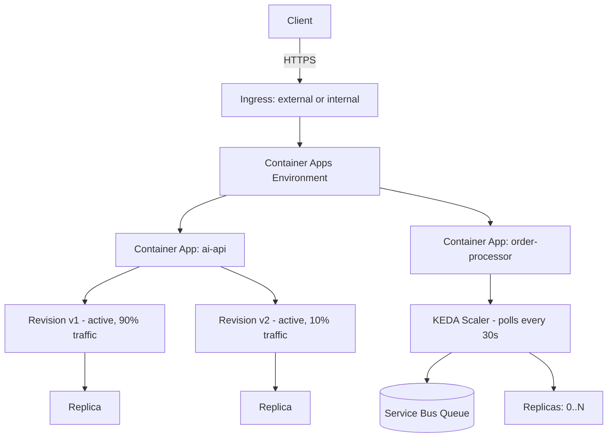

# 2. Deploy, Manage, and Scale Apps on Azure Container Apps

> **Domain D1 · Develop containerized solutions on Azure · 20–25% of exam**
> **Services:** Azure Container Apps, Azure Container Registry, Azure Kubernetes Service, Azure Service Bus, Azure Event Hubs, Azure Storage Queue, Azure Monitor · **Study time:** ~75 min · **Difficulty:** core
> **Source:** Course AI-200T00-A — Deploy and manage apps on Azure Container Apps

---

## 0. Syllabus Alignment

| Objective | Official skill | Covered in |
|---|---|---|
| `D1.2.a` | Container Apps: deploy, environment config, revision management (ingress, traffic split) | §2.1, §2.2, §2.3, §2.4, §2.5 |
| `D1.2.b` | Event-driven scaling with KEDA in Container Apps | §2.9, §2.10, §2.11 |
| `D1.2.c` | AKS: deploy and manage apps via manifest files | §2.12, §8 |
| `D1.2.d` | Monitor/troubleshoot AKS and Container Apps: logs, events, connectivity | §2.6, §2.7, §2.8, §2.12, §8 |

---

## 1. Architectural Summary

Azure Container Apps is a serverless container runtime built on top of Kubernetes and KEDA, but it hides the control plane: you never see nodes, node pools, or cluster upgrades. You get a **Container Apps environment** as your isolation boundary, **revisions** as immutable versioned snapshots of your app's template, and **replicas** as the running instances of a revision. This model trades Kubernetes-level control for operational simplicity — you describe desired ingress, scaling rules, and configuration, and the platform reconciles replica count against KEDA-evaluated triggers every 15–30 seconds.

For AI workloads specifically, this matters in two ways. First, request-driven APIs (embeddings, inference, document processing) need fast, safe rollout — revision modes and traffic splitting let you canary a new model version before committing 100% of traffic. Second, asynchronous pipelines (OCR queues, batch classification) need event-driven scale-to-zero — KEDA scalers watch a Service Bus queue or Event Hub and spin replicas up only when there's real backlog, so idle background workers cost nothing.

Container Apps is **not** a substitute for full Kubernetes control. When you need custom admission controllers, CRDs, direct pod scheduling, or manifest-driven multi-resource orchestration, you move to AKS — a domain the exam tests separately (see §2.12 for the boundary and its gap in this note's source material).



**Where this fits:** Container Apps sits between App Service (no Kubernetes primitives at all) and AKS (full manifest-driven control); choose it when you want KEDA-based event scaling and revision-based rollout without owning cluster lifecycle.

---

## 2. Core Concepts

### 2.1 Container Apps Environments

An environment is the shared boundary for networking and observability integration — apps in the same environment can reach each other over internal DNS, and logs typically flow to a shared Log Analytics backend. You choose the number of environments as an isolation/operations trade-off: separate dev/test/prod to reduce blast radius, but keep tightly-coupled services (API + background worker) together so internal ingress works.

```bash
az extension add --name containerapp --upgrade

az group create --name rg-aca-demo --location centralus

az containerapp env create \
    --name aca-env-demo \
    --resource-group rg-aca-demo \
    --location centralus

az containerapp env show --name aca-env-demo --resource-group rg-aca-demo
```

Ingress is set per app with `--ingress external` (public callers) or `--ingress internal` (only reachable from other apps in the same environment) — this is the primary control for exposure surface.

> [!TIP] **Exam angle**
> Expect a scenario naming "shared networking and logging boundary" and asking which resource that is — the answer is the **environment**, not the revision or replica.

> [!WARNING] **Gotcha**
> Preview features may require `--allow-preview true` on the containerapp extension; forgetting `--upgrade` on the extension is a common source of "unrecognized argument" errors on newer flags.

### 2.2 Deployment Mechanics: CLI vs YAML

```bash
az login
az upgrade
az extension add --name containerapp --upgrade

az provider register --namespace Microsoft.App
az provider register --namespace Microsoft.OperationalInsights
```

`az containerapp up` is the fastest path — it can create the environment itself and returns the FQDN in one shot:

```bash
az containerapp up \
    --name my-container-app \
    --resource-group rg-aca-demo \
    --location centralus \
    --environment aca-env-demo \
    --image mcr.microsoft.com/k8se/quickstart:latest \
    --target-port 80 \
    --ingress external \
    --query properties.configuration.ingress.fqdn
```

`az containerapp create` is more explicit and pairs with a pre-created environment for consistent multi-app deployments. `az containerapp update --image` applies a new image and creates a new revision.

YAML is the reviewable, source-controlled alternative — when you pass `--yaml`, **other CLI flags are ignored** and the file becomes the full configuration source:

```bash
az containerapp create \
    --name ai-api \
    --resource-group rg-aca-demo \
    --environment aca-env-demo \
    --yaml ./containerapp.yml

az containerapp update -n ai-api -g rg-aca-demo --yaml ./containerapp.yml
```

Other deployment surfaces exist (Bicep, GitHub Actions, portal), but the CLI/YAML properties remain the ones you inspect when troubleshooting regardless of pipeline.

> [!WARNING] **Gotcha**
> Image repository paths must be **lower case** (e.g., `mcr.microsoft.com/k8se/quickstart`); an upper-case segment produces pull failures that look like authentication errors, not casing errors.

### 2.3 Runtime Configuration: Environment Variables & Secrets

Non-sensitive settings use environment variables; sensitive values (API keys, connection strings) go into Container Apps **secrets** so images stay portable and secrets rotate without a rebuild.

```bash
az containerapp create -n ai-api -g rg-aca-demo \
    --environment aca-env-demo \
    --image myregistry.azurecr.io/ai-api:v1 \
    --ingress external --target-port 8000 \
    --env-vars LOG_LEVEL=info FEATURE_EMBEDDINGS=true

az containerapp update -n ai-api -g rg-aca-demo \
    --set-env-vars LOG_LEVEL=debug

az containerapp secret set -n ai-api -g rg-aca-demo \
    --secrets embeddings-api-key="REPLACE_WITH_REAL_VALUE"

az containerapp update -n ai-api -g rg-aca-demo \
    --set-env-vars EMBEDDINGS_API_KEY=secretref:embeddings-api-key
```

The `secretref:<secret-name>` value format maps an env var to a secret without exposing the value in configuration. Azure Key Vault references are also supported for secrets when Key Vault should be the system of record.

> [!TIP] **Exam angle**
> "Rotate an API key without rebuilding the image" always points to Container Apps **secrets + `secretref:`**, not environment variables and not baking values into the image.

### 2.4 Private Registry Authentication

| Method | Setup | Best fit |
|---|---|---|
| Username/password | `--server`, `--username`, `--password` | Quick validation, non-ACR registries |
| Managed identity | `--server`, `--identity system` | Production ACR pulls, avoids long-lived credentials |

```bash
az containerapp registry set -n ai-api -g rg-aca-demo \
    --server myregistry.azurecr.io \
    --username MyRegistryUsername \
    --password MyRegistryPassword

# Managed identity form (grant the identity AcrPull on the registry first)
az containerapp registry set -n ai-api -g rg-aca-demo \
    --server myregistry.azurecr.io \
    --identity system

az containerapp registry list -n ai-api -g rg-aca-demo
az containerapp registry show -n ai-api -g rg-aca-demo --server myregistry.azurecr.io
```

Grant only the `AcrPull` role to identities that pull images — least privilege for supply-chain risk reduction.

> [!WARNING] **Gotcha**
> Registry misconfiguration surfaces as image pull failures in container logs that *look like* auth errors even when the true cause is a stale credential or missing role assignment — always check registry config (`registry show`) before assuming an app-code bug.

### 2.5 Revision Management, Modes & Traffic Splitting

A **revision** is an immutable snapshot; you can't edit one, only create a new one. Changes split into two categories:

| Change scope | Examples | Creates new revision? |
|---|---|---|
| Revision-scope | container image, scale rules, env vars (anything under `template`) | Yes |
| Application-scope | secrets, ingress settings, traffic-split weights | No |

**Revision modes:**

| Mode | Active revisions | Traffic control | Scenario |
|---|---|---|---|
| Single (default) | One | Automatic — platform shifts 100% once new revision is healthy | Straightforward replace-on-deploy |
| Multiple | Many | Manual weights via traffic splitting | Canary, blue-green, A/B testing |

```bash
az containerapp update -n order-api -g rg-ecommerce --revision-mode multiple

az containerapp ingress traffic set \
  --name order-api --resource-group rg-ecommerce \
  --revision-weight order-api--v1=80 order-api--v2=20
```

Use **image digests** (`myregistry.azurecr.io/app@sha256:<digest>`) for production traceability — tags like `latest` are mutable and don't prove which artifact served an incident.

**Revision lifecycle commands:**

```bash
az containerapp revision list -n ai-api -g rg-aca-demo -o table
az containerapp revision list -n ai-api -g rg-aca-demo --all
az containerapp revision show -n ai-api -g rg-aca-demo --revision <revision-name>
az containerapp revision deactivate -n ai-api -g rg-aca-demo --revision <revision-name>
```

Container Apps automatically purges inactive revisions past **100**; adjust with `--max-inactive-revisions`. **Deactivate before deleting** — it preserves evidence during an incident while stopping traffic.

**Revision labels** give a stable URL directly to one revision, independent of traffic-split weights — useful for tester validation before a revision joins the canary split. Label names must start with a letter, use only lowercase alphanumeric characters and dashes, disallow consecutive dashes, and stay ≤64 characters.

> [!WARNING] **Gotcha**
> Two revisions each with `minReplicas: 1` splitting traffic 50/50 can together consume **more** resources than one revision taking 100% traffic — each revision scales independently against its own share, so a single scale-out threshold may never trigger on either side.

### 2.6 Lifecycle Actions & Troubleshooting Checklist

App-level actions are broader than revision actions — use them when the whole app, not one bad release, needs to pause.

```bash
az containerapp stop --name ai-api --resource-group rg-aca-demo
az containerapp start --name ai-api --resource-group rg-aca-demo
az containerapp restart --name ai-api --resource-group rg-aca-demo
```

Restart clears transient failure states but isn't root-cause analysis — pair it with log inspection. When a revision fails, validate these categories first:

- **Image pull failures** — missing/invalid registry credentials, wrong image reference.
- **Port mismatches** — container listens on a port different from the configured ingress target port.
- **Missing configuration** — required env vars or secrets absent/misnamed.
- **Probe failures** — wrong path, or too little startup time for model loading.
- **Resource pressure** — memory limit kills the replica, or CPU throttling slows it.

```bash
az containerapp revision list -n ai-api -g rg-aca-demo \
  --query "[].{name:name,active:properties.active,health:properties.healthState}" -o table
```

### 2.7 Health Probes: Readiness vs Liveness

Readiness gates traffic ("can this replica take requests now?"); liveness gates the process ("should this replica be restarted?"). AI services with model-loading startup should tune readiness generously and keep liveness conservative to avoid restart storms mid-warm-up.

```yaml
# Code fragment - focus on readiness and liveness probes
properties:
  template:
    containers:
    - name: api
      image: <registry>/<repo>@sha256:<digest>
      probes:
      - type: Readiness
        httpGet:
          path: /health/ready
          port: 8080
        initialDelaySeconds: 20
        periodSeconds: 10
        timeoutSeconds: 2
        failureThreshold: 3
      - type: Liveness
        httpGet:
          path: /health/live
          port: 8080
        initialDelaySeconds: 60
        periodSeconds: 10
        timeoutSeconds: 2
        failureThreshold: 3
```

> [!WARNING] **Gotcha**
> Liveness failing shortly after startup usually means liveness is **too aggressive**, not that the app is truly broken — check `initialDelaySeconds` before assuming a code defect.

### 2.8 Monitoring & Logs

```bash
az containerapp show -n ai-api -g rg-aca-demo

az containerapp logs show -n ai-api -g rg-aca-demo
az containerapp logs show -n ai-api -g rg-aca-demo --follow --tail 30
az containerapp logs show -n ai-api -g rg-aca-demo --type system

az containerapp replica list -n ai-api -g rg-aca-demo
az containerapp replica list -n ai-api -g rg-aca-demo --revision MyRevision
```

Console logs (`--type console`, the default) answer application-level questions; system logs (`--type system`) answer platform-level questions (scheduling, scaling events). Recommended structured-log fields for AI troubleshooting: request identifier, revision/build identifier, model version, latency breakdown — log identifiers and metadata, not raw prompts or documents.

Troubleshooting workflow: (1) confirm active vs failing revision, (2) stream logs while reproducing, (3) diff configuration between working and failing revisions, (4) apply a targeted fix and re-verify the next revision becomes ready.

> [!TIP] **Exam angle**
> "Fastest first step to diagnose a failed startup" is always **`az containerapp logs show`** before revision list or replica list — logs surface the actual error; revision/replica commands only surface state.

### 2.9 Scale Rules: HTTP, TCP, CPU, Memory

A scale definition has three parts: **limits** (min/max replicas), **rules** (triggers), **behavior** (timing algorithm). Container Apps is powered by KEDA under the hood.

| Rule type | Metric window | Scale-to-zero? | Best fit |
|---|---|---|---|
| HTTP | Concurrent requests over 15s, ÷15 | Yes | Synchronous APIs |
| TCP | Concurrent connections over 15s | Yes | WebSocket, gRPC, DB connection pools |
| CPU | Utilization %, 30s poll | **No** — always ≥1 replica | Compute-intensive (image/video processing) |
| Memory | Utilization %, 30s poll | **No** — always ≥1 replica | Memory-intensive (caching, aggregation) |

Default: ingress enabled with no custom rules → up to **10 replicas**, min **0**. If ingress is disabled and no min-replica or custom scale rule is set, the app scales to zero **and can't restart** — there's no trigger to wake it.

```bash
az containerapp create \
  --name order-api --resource-group rg-ecommerce --environment my-environment \
  --image myregistry.azurecr.io/order-api:v1 \
  --min-replicas 1 --max-replicas 10 \
  --scale-rule-name http-scaling --scale-rule-type http \
  --scale-rule-http-concurrency 50
```

Default HTTP concurrency threshold is **10 requests per replica** if unspecified. Combine rules in YAML — the platform scales out when **any** rule's threshold is met:

```yaml
scale:
  minReplicas: 1
  maxReplicas: 20
  rules:
    - name: http-scaling
      http:
        metadata:
          concurrentRequests: "100"
    - name: cpu-scaling
      custom:
        type: cpu
        metadata:
          type: Utilization
          value: "70"
```

**Scaling behavior timing:**

| Parameter | Value |
|---|---|
| Custom scaler poll interval (CPU/memory/event-driven) | 30 seconds |
| HTTP/TCP calculation window | 15 seconds |
| Cool-down before scale-to-zero | 300 seconds (5 min) default |
| Scale-up stabilization window | 0 seconds (immediate) |
| Scale-up step pattern | 1, 4, 8, 16, 32… (doubling) |
| Scale-down stabilization window | 300 seconds |
| Scale-down behavior | All excess replicas removed at once |

> [!WARNING] **Gotcha**
> CPU and memory rules **cannot** scale to zero — even with `--min-replicas 0` set, the platform holds at least one replica because it needs a running instance to measure utilization. For a scale-to-zero worker, use HTTP, TCP, or an event-driven (KEDA) trigger instead.

### 2.10 KEDA Event-Driven Scaling

Container Apps translates KEDA `ScaledObject` specs into scale rules and polls custom scalers every **30 seconds**. Microsoft maintains first-party scalers for Service Bus, Event Hubs, Storage Queue, Blob Storage, Log Analytics, and Monitor; community scalers cover Kafka, Redis, Cron, Prometheus, and more.

| Scaler | Key metadata | Notes |
|---|---|---|
| `azure-servicebus` | `queueName`/`topicName`+`subscriptionName`, `namespace`, `messageCount` | Replica count = message count ÷ `messageCount` |
| `azure-queue` (Storage Queue) | `accountName`, `queueName`, `queueLength` | Lower cost, fewer features than Service Bus |
| `azure-eventhub` | `consumerGroup`, `unprocessedEventThreshold`, `checkpointStrategy` (`blobMetadata` recommended) | Max useful replicas = partition count |
| `kafka` | `bootstrapServers`, `consumerGroup`, `topic`, `lagThreshold` | SASL/PLAIN, SASL/SCRAM, TLS auth |
| Redis Lists | `address`, `listName`, `listLength` | Uses `LLEN` |
| Redis Streams | consumer-group pending entries | Handles in-flight work better than Lists |
| `cron` | `timezone`, `start`, `end`, `desiredReplicas` | Cron-expression scale windows |
| Prometheus | `serverAddress`, `metricName`, `query`, `threshold` | PromQL-driven custom metrics |

```bash
az containerapp create \
  --name order-processor --resource-group rg-ecommerce --environment my-environment \
  --image myregistry.azurecr.io/order-processor:v1 \
  --min-replicas 0 --max-replicas 30 \
  --secrets "sb-connection=<SERVICE_BUS_CONNECTION_STRING>" \
  --scale-rule-name servicebus-scaling --scale-rule-type azure-servicebus \
  --scale-rule-metadata "queueName=orders" "namespace=sb-ecommerce" "messageCount=5" \
  --scale-rule-auth "connection=sb-connection"
```

Example: `messageCount=5` with 50 messages queued → scaler requests 10 replicas. Managed identity (`--scale-rule-identity`) is preferred over secret-based auth for production — no connection strings to rotate:

```bash
az containerapp create \
  --name queue-processor --resource-group rg-ecommerce --environment my-environment \
  --image myregistry.azurecr.io/queue-processor:v1 \
  --user-assigned <MANAGED_IDENTITY_RESOURCE_ID> \
  --min-replicas 0 --max-replicas 20 \
  --scale-rule-name storage-queue-scaling --scale-rule-type azure-queue \
  --scale-rule-metadata "accountName=stecommerce" "queueName=inventory-updates" "queueLength=10" \
  --scale-rule-identity <MANAGED_IDENTITY_RESOURCE_ID>
```

Cron scalers combine with reactive scalers to pre-warm capacity: when multiple scalers are active, Container Apps uses the **highest** replica count among them.

> [!TIP] **Exam angle**
> "Scale to zero when queue empty, scale out as backlog grows" = **event-driven KEDA scaler** with `--min-replicas 0`. This is the discriminator against CPU/memory rules, which can never reach zero.

### 2.11 Compute Resources & Workload Profiles

CPU is set in cores (fractional allowed); memory in GiB. **Memory must be at least 2× the CPU value** (e.g., 0.5 CPU → minimum 1.0 GiB memory). Default allocation is **0.25 cores / 0.5 GiB**. Consumption plan caps at **4 cores / 8 GiB per container**.

```bash
az containerapp create \
  --name order-api --resource-group rg-ecommerce --environment my-environment \
  --image myregistry.azurecr.io/order-api:v1 \
  --cpu 0.5 --memory 1.0Gi \
  --min-replicas 2 --max-replicas 20
```

Exceeding the **memory** limit terminates and restarts the replica (hard failure); exceeding the **CPU** limit throttles it (performance degradation, no restart) — a key diagnostic distinction.

| Environment type | Billing model | Max per container | GPU |
|---|---|---|---|
| Consumption-only | Serverless, pay-per-use | 4 cores / 8 GiB | No |
| Workload profiles → Consumption profile | Same serverless billing | 4 cores / 8 GiB | No |
| Workload profiles → Dedicated profile | Reserved VM capacity | Larger allocations | Required for GPU workloads |

Maximum replica count is **1000 per revision**. Billing is based on vCPU-seconds and GiB-seconds; scale-to-zero incurs no compute charge, idle-but-running replicas bill at a lower idle rate.

> [!WARNING] **Gotcha**
> "Consistent low-variance latency" and "GPU inference" both point to **Dedicated workload profile**, not Consumption — Consumption shares tenant resources and caps at 4 cores/8 GiB.

### 2.12 AKS: Manifest-Based Deployment (Coverage Gap)

The source material for this note covers **Azure Container Apps exclusively across all three modules** — no AKS manifest, `kubectl`, pod, namespace, or Kubernetes Service (`Service`/`Deployment` object) content is present. The only grounded AKS-adjacent fact is architectural: Container Apps lets you deploy containerized services "without managing Kubernetes control planes or building custom orchestration layers," implying AKS is the alternative where you **do** manage that control plane and author manifests directly.

`D1.2.c` (deploy/manage via manifest files) and the AKS half of `D1.2.d` (`kubectl logs`, `kubectl describe`, events, probes tied to Kubernetes-native tooling) are **not covered** by this learning path's source units. See §8.

---

## 3. Production Code

### 3.1 Azure CLI

End-to-end sequence: environment, private-registry app with secrets, canary rollout, and an event-driven worker.

```bash
# 1. Prep and environment
az login
az extension add --name containerapp --upgrade
az provider register --namespace Microsoft.App
az provider register --namespace Microsoft.OperationalInsights

az group create --name rg-aca-demo --location centralus
az containerapp env create --name aca-env-demo --resource-group rg-aca-demo --location centralus

# 2. Deploy the API from a private registry using managed identity
#    (prerequisite: grant AcrPull to the app's system identity — see §8)
az containerapp create \
  --name ai-api --resource-group rg-aca-demo --environment aca-env-demo \
  --image myregistry.azurecr.io/ai-api:v1 \
  --ingress external --target-port 8000 \
  --env-vars LOG_LEVEL=info FEATURE_EMBEDDINGS=true \
  --min-replicas 1 --max-replicas 10 \
  --scale-rule-name http-scaling --scale-rule-type http --scale-rule-http-concurrency 50

az containerapp registry set -n ai-api -g rg-aca-demo --server myregistry.azurecr.io --identity system

# 3. Secret for the embeddings provider
az containerapp secret set -n ai-api -g rg-aca-demo --secrets embeddings-api-key="REPLACE_WITH_REAL_VALUE"
az containerapp update -n ai-api -g rg-aca-demo --set-env-vars EMBEDDINGS_API_KEY=secretref:embeddings-api-key

# 4. Canary rollout: deploy v2 image, enable multiple revision mode, split traffic
az containerapp update -n ai-api -g rg-aca-demo --revision-mode multiple
az containerapp update -n ai-api -g rg-aca-demo --image myregistry.azurecr.io/ai-api@sha256:REPLACE_WITH_DIGEST
az containerapp ingress traffic set -n ai-api -g rg-aca-demo \
  --revision-weight ai-api--v1=90 ai-api--v2=10

# 5. Event-driven background worker, scale-to-zero on Service Bus backlog
az containerapp create \
  --name order-processor --resource-group rg-aca-demo --environment aca-env-demo \
  --image myregistry.azurecr.io/order-processor:v1 \
  --min-replicas 0 --max-replicas 30 \
  --secrets "sb-connection=REPLACE_WITH_CONNECTION_STRING" \
  --scale-rule-name servicebus-scaling --scale-rule-type azure-servicebus \
  --scale-rule-metadata "queueName=orders" "namespace=sb-ecommerce" "messageCount=5" \
  --scale-rule-auth "connection=sb-connection"

# 6. Verify
az containerapp revision list -n ai-api -g rg-aca-demo -o table
az containerapp logs show -n ai-api -g rg-aca-demo --follow --tail 30
```

### 3.3 Infrastructure (Container App YAML)

```yaml
# containerapp.yml - full runtime definition: probes, scaling, secrets
properties:
  configuration:
    ingress:
      external: true
      targetPort: 8000
    secrets:
      - name: embeddings-api-key
        value: REPLACE_WITH_REAL_VALUE
  template:
    containers:
      - name: ai-api
        image: myregistry.azurecr.io/ai-api@sha256:REPLACE_WITH_DIGEST
        env:
          - name: LOG_LEVEL
            value: info
          - name: EMBEDDINGS_API_KEY
            secretRef: embeddings-api-key
        probes:
          - type: Readiness
            httpGet:
              path: /health/ready
              port: 8080
            initialDelaySeconds: 20
            periodSeconds: 10
            timeoutSeconds: 2
            failureThreshold: 3
          - type: Liveness
            httpGet:
              path: /health/live
              port: 8080
            initialDelaySeconds: 60
            periodSeconds: 10
            timeoutSeconds: 2
            failureThreshold: 3
    scale:
      minReplicas: 1
      maxReplicas: 20
      rules:
        - name: http-scaling
          http:
            metadata:
              concurrentRequests: "100"
        - name: cpu-scaling
          custom:
            type: cpu
            metadata:
              type: Utilization
              value: "70"
```

```bash
az containerapp update -n ai-api -g rg-aca-demo --yaml ./containerapp.yml
```

---

## 4. Memory Tricks & Mnemonics

### Mnemonics
| Device | Expands to | Locks in |
|---|---|---|
| **LRB** | Limits, Rules, Behavior | The three parts of a scale definition |
| **1-4-8-16-32** | Doubling scale-up steps | Scale-up is stepped/doubled, not linear |
| **"Tag today, digest forever"** | Tag = mutable pointer, digest = immutable hash | Why production references use `@sha256:` |
| **"Ready gates in, live keeps alive"** | Readiness = traffic gate, Liveness = restart trigger | Which probe does what |

### Analogies
- **Revision** — like a Git commit for your app's config: immutable, inspectable, and the unit you roll back to.
- **KEDA scaler** — a thermostat reading an external gauge (queue depth, lag) instead of the room temperature (CPU) — it reacts to backlog, not load.
- **Revision label** — a side door with a fixed key, separate from the front door's (traffic-split) rotating lock combination.

### Decision Matrix
| If the question says… | Answer | Because |
|---|---|---|
| "scale to zero when the queue is empty" | Event-driven (KEDA) scale rule, `--min-replicas 0` | CPU/memory rules can never reach zero — they always hold ≥1 replica |
| "canary 10% of traffic to a new model version" | Multiple revision mode + `az containerapp ingress traffic set --revision-weight` | Single revision mode auto-shifts 100%, no partial split |
| "rotate an API key without redeploying" | Container Apps secret + `secretref:` env var | Decouples secret value from image and from YAML source control |
| "prove which image build served an incident" | Reference by digest (`@sha256:...`) | Tags are mutable; digests are immutable |
| "WebSocket/gRPC service scaling" | TCP scale rule | HTTP concurrency counts request/response cycles, not persistent connections |
| "pre-warm before a known 8am peak but still scale to zero overnight" | Cron scaler combined with HTTP scaler | Highest replica count among active scalers wins |
| "pull image from ACR without storing a password" | Managed identity (`--identity system`) + `AcrPull` role | Avoids long-lived credential storage/rotation |
| "app never starts and can't be woken up" | Ingress disabled + no min-replicas + no custom scale rule | No trigger exists to activate a replica |
| "GPU inference workload" | Dedicated workload profile | Consumption plan doesn't support GPU and caps at 4 cores/8 GiB |
| "fastest first diagnostic step on a crash-looping revision" | `az containerapp logs show` | Surfaces the actual startup error before revision/replica state does |
| "pause a bad revision without losing rollback evidence" | `az containerapp revision deactivate` | Deletion destroys the artifact; deactivation preserves it |
| "replica killed vs replica slow" | Memory limit → kill/restart; CPU limit → throttle | Different failure signatures for the same symptom category |

---

## 5. Quick Q&A — Active Recall

**Q1.** What's the fastest CLI command to get a container image running publicly with minimal setup?

<details>
<summary>Answer</summary>

`az containerapp up` — it can create the environment for you and returns the ingress FQDN in one step, unlike `az containerapp create` which requires an existing environment.

</details>

**Q2.** An app has `--ingress internal`, no `--min-replicas` set, and no custom scale rule. What happens, and why?

<details>
<summary>Answer</summary>

The app scales to zero and never restarts, because there's no ingress-driven or custom trigger to activate a replica. This only happens when ingress is disabled/internal-only and no min-replica or custom rule compensates.

</details>

**Q3.** You set an environment variable's value to `secretref:embeddings-api-key`. What does this achieve?

<details>
<summary>Answer</summary>

It maps the env var to a Container Apps secret at runtime without exposing the secret value in YAML, source control, or CLI history — the app reads a normal env var, but the value is resolved from the secret store.

</details>

**Q4.** Why can't a CPU-based scale rule scale a background worker to zero replicas?

<details>
<summary>Answer</summary>

CPU (and memory) scaling requires at least one running replica to measure utilization, so the platform always maintains a minimum of one replica regardless of the configured `--min-replicas` value. Use an HTTP, TCP, or event-driven (KEDA) rule instead.

</details>

**Q5.** Readiness vs liveness probe — which one, if misconfigured, causes unnecessary restarts during a long model-loading startup?

<details>
<summary>Answer</summary>

Liveness. If `initialDelaySeconds` is too short for liveness, the platform restarts a replica that's still legitimately loading, creating a restart loop. Readiness failing just withholds traffic — it doesn't restart the process.

</details>

**Q6.** You need to validate a new revision with real production traffic without exposing it to all users, then roll it back easily if it fails. What two mechanisms combine to do this?

<details>
<summary>Answer</summary>

Multiple revision mode plus traffic splitting (`az containerapp ingress traffic set --revision-weight`) for gradual rollout, and revision labels for direct tester access outside the split. Rollback is just re-weighting traffic back to the stable revision, which remains active.

</details>

**Q7.** How does Azure Container Apps differ from AKS in terms of what you must manage directly?

<details>
<summary>Answer</summary>

Container Apps lets you deploy containerized services without managing the Kubernetes control plane or building custom orchestration layers — the platform handles that. AKS requires you to author and apply Kubernetes manifests and manage cluster-level resources directly (this AKS side is not covered by this note's source material — see §8).

</details>

**Q8.** Two revisions are each running with `minReplicas: 1` under a 50/50 traffic split. Why might total resource consumption exceed what a single 100%-traffic revision would need?

<details>
<summary>Answer</summary>

Each revision scales independently against only its own share of traffic. Both maintain their own minimum replica floor and evaluate their own scale-out thresholds against half the load, so neither triggers additional scale-out that a single revision at full traffic might have needed — yet both already consume their baseline replicas.

</details>

---

## 6. Hands-On Challenge

### 6.1 Problem

**Scenario.** You're building the backend for an AI document-processing product: a synchronous `ai-api` service (accepts uploads, calls an embeddings provider) and an asynchronous `order-processor`-style worker that drains a Service Bus queue of OCR jobs. Product wants zero idle cost for the worker, safe canary rollout for the API when you ship a new embeddings model version, and a private ACR registry for both images.

**Build it.**
1. Create a resource group and one Container Apps environment for both apps.
2. Deploy `ai-api` from a private ACR image using managed identity for registry pull, with an HTTP scale rule (concurrency 50, min 1/max 10) and a secret-backed `EMBEDDINGS_API_KEY`.
3. Enable multiple revision mode on `ai-api`, deploy a v2 image, and split traffic 90/10 for canary validation.
4. Deploy `order-processor` with an `azure-servicebus` KEDA scale rule, `--min-replicas 0`, `--max-replicas 30`.
5. Generate concurrent load against `ai-api` and confirm replica scale-out.

**Done when:** `az containerapp revision list` on `ai-api` shows two active revisions with the 90/10 weight, `order-processor` sits at 0 replicas when the queue is empty and scales out when messages are enqueued, and logs confirm no image-pull or probe failures.

**Est. time:** 45 min · **Teardown:** `az group delete -n rg-aca-demo --yes --no-wait`

### 6.2 Reference Solution

```bash
# Step 1 — Resource group and shared environment
az group create --name rg-aca-demo --location centralus
az containerapp env create --name aca-env-demo --resource-group rg-aca-demo --location centralus
```

```bash
# Step 2 — Deploy ai-api with managed-identity registry pull, HTTP scaling, secret
az containerapp create \
  --name ai-api --resource-group rg-aca-demo --environment aca-env-demo \
  --image myregistry.azurecr.io/ai-api:v1 \
  --ingress external --target-port 8000 \
  --min-replicas 1 --max-replicas 10 \
  --scale-rule-name http-scaling --scale-rule-type http --scale-rule-http-concurrency 50

az containerapp registry set -n ai-api -g rg-aca-demo --server myregistry.azurecr.io --identity system

az containerapp secret set -n ai-api -g rg-aca-demo --secrets embeddings-api-key="REPLACE_WITH_REAL_VALUE"
az containerapp update -n ai-api -g rg-aca-demo --set-env-vars EMBEDDINGS_API_KEY=secretref:embeddings-api-key
```

```bash
# Step 3 — Canary rollout: multiple revision mode, deploy v2, split 90/10
az containerapp update -n ai-api -g rg-aca-demo --revision-mode multiple
az containerapp update -n ai-api -g rg-aca-demo --image myregistry.azurecr.io/ai-api@sha256:REPLACE_WITH_DIGEST
az containerapp ingress traffic set -n ai-api -g rg-aca-demo \
  --revision-weight ai-api--v1=90 ai-api--v2=10
```

```bash
# Step 4 — Event-driven order-processor worker, scale-to-zero
az containerapp create \
  --name order-processor --resource-group rg-aca-demo --environment aca-env-demo \
  --image myregistry.azurecr.io/order-processor:v1 \
  --min-replicas 0 --max-replicas 30 \
  --secrets "sb-connection=REPLACE_WITH_CONNECTION_STRING" \
  --scale-rule-name servicebus-scaling --scale-rule-type azure-servicebus \
  --scale-rule-metadata "queueName=orders" "namespace=sb-ecommerce" "messageCount=5" \
  --scale-rule-auth "connection=sb-connection"
```

```python
# Step 5 — Generate concurrent load against ai-api to trigger HTTP scale-out
import concurrent.futures
import requests

FQDN = "https://ai-api.REPLACE_WITH_ENV_DOMAIN.centralus.azurecontainerapps.io"

def call_api(i: int) -> int:
    resp = requests.post(f"{FQDN}/process", json={"doc_id": i}, timeout=10)
    return resp.status_code

with concurrent.futures.ThreadPoolExecutor(max_workers=100) as executor:
    results = list(executor.map(call_api, range(500)))

print(f"Completed {len(results)} requests, {results.count(200)} succeeded")
```

```bash
# Verify
az containerapp revision list -n ai-api -g rg-aca-demo \
  --query "[].{name:name,active:properties.active}" -o table
az containerapp replica list -n order-processor -g rg-aca-demo
```

### 6.3 Commentary

Step 1 establishes the shared environment (`D1.2.a`) — both apps need it for internal DNS and shared logging even though only `ai-api` needs external ingress. Step 2 rejects username/password registry auth in favor of managed identity (`D1.2.a`), the production-preferred path per §2.4, and uses secret + `secretref:` rather than plain env vars for the API key. Step 3 is the core `D1.2.a` revision-management test: single revision mode was rejected because it can't do partial traffic splits — multiple revision mode plus `ingress traffic set` is the only mechanism that satisfies "canary 10%." Step 4 directly targets `D1.2.b`: a CPU or memory rule was rejected because neither can scale to zero, so the `azure-servicebus` KEDA scaler with `--min-replicas 0` is the only correct choice for an idle-cost-zero worker. Step 5 exercises `D1.2.d` monitoring — the load generator forces HTTP-rule scale-out so you can observe replica count change via `az containerapp replica list`, and any failures would be diagnosed first via `az containerapp logs show` per the §2.8 workflow, not by jumping straight to resource-limit changes.

---

## 7. Exam-Day Cheatsheet

**Key facts**
- `az containerapp up` — one-shot create environment + app + ingress; `az containerapp create` needs an existing environment.
- `--yaml` on create/update makes YAML the **sole** configuration source — other flags are ignored.
- Default HTTP concurrency threshold: **10 requests/replica**. Default CPU/memory/event polling: **30s**. HTTP/TCP window: **15s**.
- Cool-down before scale-to-zero: **300s**. Scale-up steps double: **1, 4, 8, 16, 32…**.
- CPU and memory scale rules **can never** reach zero replicas — always ≥1.
- Inactive revisions auto-purge past **100**; override with `--max-inactive-revisions`.
- Memory limit exceeded → replica **terminated/restarted**; CPU limit exceeded → replica **throttled** (no restart).
- Memory must be ≥ **2× CPU** in GiB. Default resources: **0.25 core / 0.5 GiB**. Consumption cap: **4 cores / 8 GiB** per container. Max replicas: **1000** per revision.

**Commands worth knowing cold**
```bash
az containerapp up --name <app> -g <rg> --image  --ingress external --target-port <port>
az containerapp update -n <app> -g <rg> --set-env-vars KEY=secretref:<secret>
az containerapp registry set -n <app> -g <rg> --server <acr>.azurecr.io --identity system
az containerapp revision list -n <app> -g <rg> --all
az containerapp revision deactivate -n <app> -g <rg> --revision <rev>
az containerapp ingress traffic set -n <app> -g <rg> --revision-weight <rev1>=90 <rev2>=10
az containerapp logs show -n <app> -g <rg> --follow --tail 30
```

**Top gotchas**
1. CPU/memory scale rules cannot scale to zero — even with `--min-replicas 0` set, one replica always runs.
2. Ingress disabled + no min-replicas + no custom scale rule = the app scales to zero and **can't wake itself up**.
3. `--yaml` silently ignores every other flag passed alongside it.
4. Tags are mutable; only digests (`@sha256:`) give you immutable production traceability.

---

## 8. Verify Before Exam

- **AKS manifest-based deployment (`D1.2.c`)** — no source unit in this learning path covers `kubectl`, Deployment/Service/Pod manifests, or namespace management. If AKS manifest syntax is tested, it must be studied from a separate AKS-focused module not included here.
- **AKS-side monitoring commands (`D1.2.d`)** — `kubectl logs`, `kubectl describe`, Kubernetes events, and Kubernetes-native probe configuration are not covered; only Container Apps' `az containerapp logs show`/`revision`/`replica` equivalents are grounded here.
- **Exact CLI syntax for granting `AcrPull` to a Container Apps system-assigned identity** (e.g., retrieving `principalId` and constructing the role-assignment scope) is not given verbatim in the source; confirm the precise `az containerapp identity show` / `az role assignment create` parameter names before relying on them in automation.
- **Default TCP concurrency threshold** — the source gives the default HTTP threshold (10 requests/replica) but does not state a default numeric threshold for TCP scale rules; confirm before an exam item hinges on it.

---

## 9. Sources

- [Introduction (Deploy containers to Azure Container Apps)](https://learn.microsoft.com/en-us/training/modules/deploy-containers-azure-container-apps/1-introduction)
- [Explore Container Apps environments](https://learn.microsoft.com/en-us/training/modules/deploy-containers-azure-container-apps/2-container-apps-environments)
- [Deploy a container app using the Azure CLI and YAML](https://learn.microsoft.com/en-us/training/modules/deploy-containers-azure-container-apps/3-deploy-container-app)
- [Configure runtime settings with environment variables and secrets](https://learn.microsoft.com/en-us/training/modules/deploy-containers-azure-container-apps/4-configure-runtime)
- [Configure image pull authentication for private registries](https://learn.microsoft.com/en-us/training/modules/deploy-containers-azure-container-apps/5-connect-to-registries)
- [Verify deployments with logs and status](https://learn.microsoft.com/en-us/training/modules/deploy-containers-azure-container-apps/6-verify-deployment)
- [Exercise - Deploy a containerized backend API to Container Apps](https://learn.microsoft.com/en-us/training/modules/deploy-containers-azure-container-apps/7-exercise-deploy-backend-api)
- [Module assessment (Deploy containers)](https://learn.microsoft.com/en-us/training/modules/deploy-containers-azure-container-apps/8-module-assessment)
- [Summary (Deploy containers)](https://learn.microsoft.com/en-us/training/modules/deploy-containers-azure-container-apps/9-summary)
- [Introduction (Manage containers in Azure Container Apps)](https://learn.microsoft.com/en-us/training/modules/manage-containers-azure-container-apps/1-introduction)
- [Update images and manage revisions safely](https://learn.microsoft.com/en-us/training/modules/manage-containers-azure-container-apps/2-update-images-manage-revisions)
- [Manage the container app lifecycle](https://learn.microsoft.com/en-us/training/modules/manage-containers-azure-container-apps/3-app-lifecycle-management)
- [Monitor logs and troubleshoot issues](https://learn.microsoft.com/en-us/training/modules/manage-containers-azure-container-apps/4-monitor-logs-troubleshoot)
- [Configure health probes and troubleshoot failures](https://learn.microsoft.com/en-us/training/modules/manage-containers-azure-container-apps/5-health-probes)
- [Optimize container resources and scaling](https://learn.microsoft.com/en-us/training/modules/manage-containers-azure-container-apps/6-optimize-container-settings)
- [Exercise - Diagnose and fix a failing deployment](https://learn.microsoft.com/en-us/training/modules/manage-containers-azure-container-apps/7-exercise-diagnose-fix-failing-deployment)
- [Module assessment (Manage containers)](https://learn.microsoft.com/en-us/training/modules/manage-containers-azure-container-apps/8-module-assessment)
- [Summary (Manage containers)](https://learn.microsoft.com/en-us/training/modules/manage-containers-azure-container-apps/9-summary)
- [Introduction (Scale containers in Azure Container Apps)](https://learn.microsoft.com/en-us/training/modules/scale-containers-azure-container-apps/1-introduction)
- [Configure scale rules](https://learn.microsoft.com/en-us/training/modules/scale-containers-azure-container-apps/2-configure-scale-rules)
- [Implement event-driven scaling with KEDA](https://learn.microsoft.com/en-us/training/modules/scale-containers-azure-container-apps/3-event-driven-scaling-keda)
- [Apply KEDA scalers for custom workloads](https://learn.microsoft.com/en-us/training/modules/scale-containers-azure-container-apps/4-keda-scalers-custom-workloads)
- [Select compute resources for performance and cost](https://learn.microsoft.com/en-us/training/modules/scale-containers-azure-container-apps/5-compute-resources-performance-cost)
- [Choose and apply revision modes](https://learn.microsoft.com/en-us/training/modules/scale-containers-azure-container-apps/6-revision-modes-traffic-management)
- [Exercise - Configure autoscaling using KEDA triggers](https://learn.microsoft.com/en-us/training/modules/scale-containers-azure-container-apps/7-exercise-configure-autoscaling-keda)
- [Module assessment (Scale containers)](https://learn.microsoft.com/en-us/training/modules/scale-containers-azure-container-apps/8-module-assessment)
- [Summary (Scale containers)](https://learn.microsoft.com/en-us/training/modules/scale-containers-azure-container-apps/9-summary)
